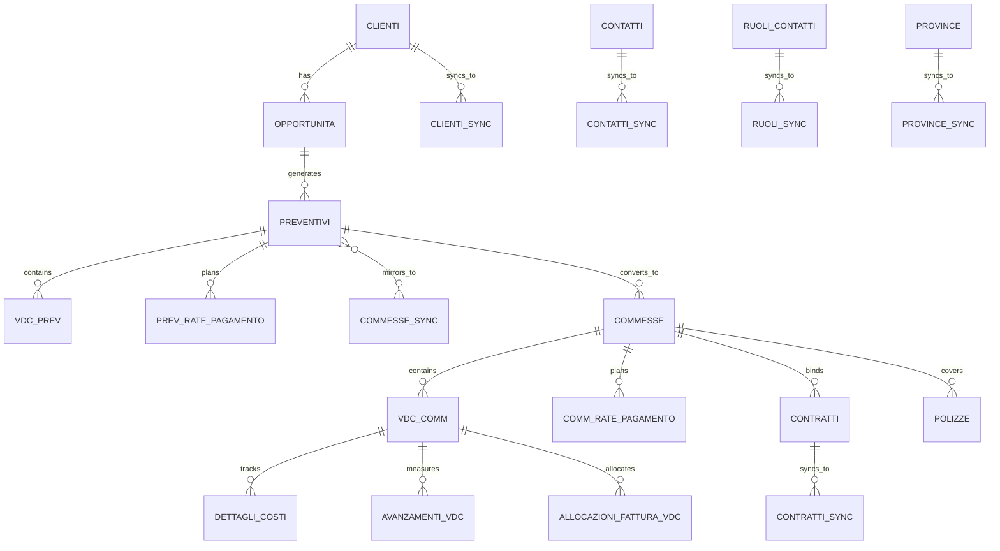
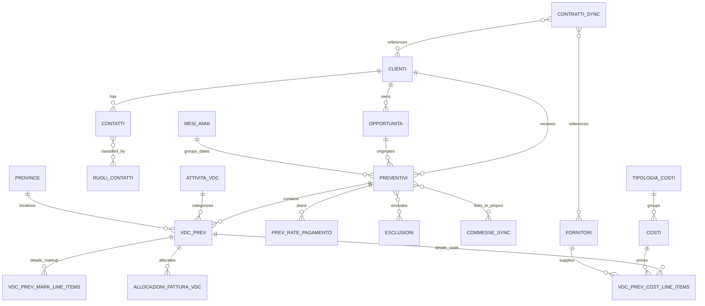
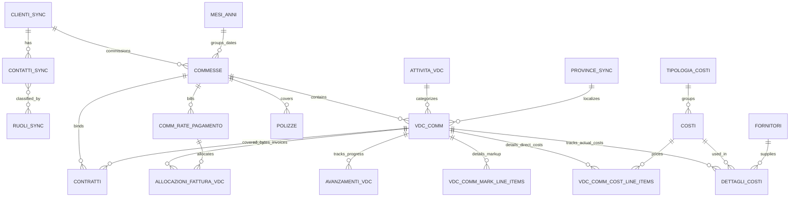

# Airtable DB Schema

## Scope

This document provides a dedicated database-schema view of the two Airtable bases:

- `Secured CPQ` (`app0KpNcZBMSC4ATa`)
- `Secured Commesse` (`app8B65UB03x6TsbS`)

It is based on direct schema inspection from Airtable and is meant to serve as the starting point for:

- relational redesign
- ERD preparation
- migration planning
- business-logic extraction

## Schema Summary

Current landscape:

- `2` Airtable bases
- `42` tables total
- `21` tables in `Secured CPQ`
- `21` tables in `Secured Commesse`

Architectural split:

- `Secured CPQ` = commercial domain
- `Secured Commesse` = delivery / execution domain

Handoff pattern:

- `Opportunità` -> `Preventivi` -> `Commesse`

Cross-base coupling is confirmed by sync and reference structures such as:

- `Commesse_sync`
- `Contratti_sync`
- `Clienti_sync`
- `Contatti_sync`
- `Ruoli_sync`
- `Province_sync`
- `preventivo_record_id`
- `preventivo_record_link`
- `commesse_prev`

## Mermaid Overview

### Cross-base overview



---

## Base 1: Secured CPQ

Base role:

- request intake
- opportunity qualification
- quote creation
- pre-project economic structure
- quote-to-project conversion trigger

### Mermaid chart



### Complete table inventory

| Table | Table ID | Primary field | Functional role |
| --- | --- | --- | --- |
| `Contatti` | `tblfhKifFtFRspPxQ` | `Nome Completo` | Contact master linked to customers, opportunities, and quotes |
| `Clienti` | `tbl6FOEf0HU3PGWsV` | `Ragione Sociale / Denominazione` | Customer master |
| `Fornitori` | `tblQKS4lL0kz8OSJc` | `Ragione Sociale / Denominazione` | Supplier master |
| `Costi` | `tblXL9aBsKG6z4ZvB` | `Name` | Cost/service catalog |
| `Attività_vdc` | `tblwaf35Ul646zQPu` | `Name` | Standard activity catalog for quote scope items |
| `esclusioni` | `tblt1st3Hs9TOct1h` | `Name` | Standard exclusions |
| `Attrezzature` | `tblmI7wXkl2WNaTdx` | `Name` | Equipment/supporting master |
| `Opportunità` | `tblwZAyoxwjtkprri` | `Nome Opportunità` | Incoming opportunities / requests |
| `Preventivi` | `tblZzYdAR3Zbeb0MD` | `Nome` | Quotations |
| `Voci di computo preventivo` | `tblSHpukN3zHKoPfS` | `Descrizione` | Quote work packages / scope lines |
| `vdc_prev_cost_line_items` | `tbldBbyi0bxBhSoxr` | `Descrizione (Note)` | Detailed cost rows for quote VDC |
| `vdc_prev_mark_line_items` | `tblRA7FQW5by8E2hC` | `Descrizione` | Markup rows for quote VDC |
| `prev_rate_pagamento` | `tblhmkPFBXo1jGalP` | `Nome_rata_completo` | Quote payment schedule |
| `File DB` | `tbleWMjPSKOtcIjdN` | `Name` | Generic document repository |
| `Ruoli_contatti` | `tblv0urWiJStTAnNV` | `Name` | Contact-role master |
| `Tipologia_costi` | `tblgv4t2k0mTDUOLk` | `Name` | Cost/service type master |
| `Province` | `tblnmHeP7Jx46ZB2b` | `Name` | Province master |
| `Mesi_anni` | `tblZNtJBQjhHA0koa` | `mese_anno` | Time dimension / month-year helper |
| `Contratti_sync` | `tblSn39Az3iH1jo2I` | `Name` | Contract mirror from execution base |
| `Commesse_sync` | `tbleZ9DbEdCBOeQfK` | `Nome` | Project mirror from execution base |
| `allocazioni_fattura_vdc` | `tblgpxvc5GuaZwIP4` | `Nome allocazione` | Quote-side invoice allocation structure |

### Core entity structure

#### `Opportunità`

Purpose:

- capture commercial opportunity before quote generation

Key fields:

- identity:
  - `Nome Opportunità` (`formula`)
  - `anno_creazione` (`formula`)
  - `number_for_assignment` (`number`)
  - `Numero_interno` (`singleLineText`)
  - `Numero_auto` (`autoNumber`)
- lifecycle:
  - `Data ricezione` (`date`)
  - `Data invio prev` (`date`)
  - `Data vinta` (`date`)
  - `Status` (`singleSelect`)
  - `Scadenza` (`formula`)
  - `Scaduta` (`formula`)
  - `Last status change` (`lastModifiedTime`)
- relationships:
  - `Clienti` (`multipleRecordLinks`)
  - `[o]Resp. Aziendale` (`multipleRecordLinks`)
  - `ref_interno_oppy` (`multipleRecordLinks`)
  - `[o]Resp. Cliente` (`multipleRecordLinks`)
  - `[o]Preventivi` (`multipleRecordLinks`)
- helper / integration:
  - `link oppy` (`formula`)
  - `button_oppy` (`button`)
  - `Record ID` (`formula`)
  - `Record ID Preventivo` (`multipleLookupValues`)

#### `Preventivi`

Purpose:

- master commercial quote entity

Key fields:

- identity:
  - `Nome` (`formula`)
  - `Numero_interno` (`singleLineText`)
  - `number_for_assignment` (`number`)
  - `Numero_libero_prev` (`singleLineText`)
  - `anno_creazione` (`formula`)
  - `Revisione` (`number`)
  - `Numero` (`autoNumber`)
  - `Rev_prossima` (`formula`)
- business data:
  - `Oggetto` (`singleLineText`)
  - `Tipologia` (`multipleSelects`)
  - `new tipologia` (`rollup`)
  - `Stima durata lavori_gg` (`rollup`)
  - `Clienti` (`multipleRecordLinks`)
  - `[o]Attenzione_di` (`multipleRecordLinks`)
  - `[o]Esecutore` (`multipleRecordLinks`)
  - `Opportunità` (`multipleRecordLinks`)
- lifecycle:
  - `Stato` (`singleSelect`)
  - `Data Emissione` (`date`)
  - `Data di invio` (`date`)
  - `Scadenza` (`formula`)
  - `Scaduto` (`formula`)
  - `Data accettazione` (`date`)
  - `Data approvazione` (`date`)
  - `Convertito` (`formula`)
- economics:
  - `cassa_di_previdenza` (`checkbox`)
  - `Perc_Markup` (`percent`)
  - `Importo Markup` (`currency`)
  - `Margine lordo` (`formula`)
  - `Margine lordo perc` (`formula`)
  - `[i]Imponibile` (`rollup`)
  - `Imponibile non scontato` (`rollup`)
  - `Sconto_perc` (`percent`)
  - `Sconto Importo` (`currency`)
  - `Check Rate` (`formula`)
  - `Totale Rate di pagamento` (`rollup`)
- detail relationships:
  - `Voci di computo preventivo` (`multipleRecordLinks`)
  - `prev_rate_pagamento` (`multipleRecordLinks`)
  - `commesse_prev` (`multipleRecordLinks`)
  - `Esclusioni` (`multipleRecordLinks`)
- integration:
  - `Proventivo_record_link` (`formula`)
  - `link_documentazione` (`url`)
  - `link_preventivo` (`url`)
  - `gdrive_progetto_link` (`url`)
  - `link_email_preventivo` (`url`)

#### `Voci di computo preventivo`

Purpose:

- quote scope lines / commercial work packages

Key fields:

- identity and classification:
  - `Descrizione` (`formula`)
  - `Nome vdc libero` (`singleLineText`)
  - `[o]Attività_principale_vdc` (`multipleRecordLinks`)
  - `Codice` (`formula`)
  - `[o]Preventivo` (`multipleRecordLinks`)
  - `Metodo di calcolo` (`singleSelect`)
- economics:
  - `v_d_c_calc_totale_markup` (`rollup`)
  - `v_d_c_calc_totale_markup_scontato` (`rollup`)
  - `v_d_c_calc_totale_ricavi_mkp` (`rollup`)
  - `v_d_c_calc_totale_ricavi_mkp_scontato` (`rollup`)
  - `v_d_c_cost_direct_tot` (`rollup`)
  - `voce_costi_indiretti_tot` (`formula`)
  - `voce_costi_totale` (`formula`)
  - `Importo` (`formula`)
  - `Importo scontato` (`formula`)
  - `sconto_vdc` (`currency`)
  - `sconto_perc_vdc` (`percent`)
  - `Margine lordo` (`formula`)
  - `Margine lordo %` (`formula`)
  - `Costi diretti %` (`formula`)
  - `Costi indiretti %` (`formula`)
  - `Costi totali %` (`formula`)
- supporting structure:
  - `[i]v_d_c_prev_cost_line_items` (`multipleRecordLinks`)
  - `[i]vdc_prev_mark_line_items` (`multipleRecordLinks`)
  - `Dettaglio Servizi` (`multipleRecordLinks`)
  - `allocazioni_fattura_vdc` (`multipleRecordLinks`)
- execution bridge:
  - province, allocation, and downstream conversion signals are already present here, showing that quote work packages are the bridge to execution work packages

### CPQ main relationship model

```text
Clienti -> Opportunità -> Preventivi -> Voci di computo preventivo
Preventivi -> prev_rate_pagamento
Voci di computo preventivo -> vdc_prev_cost_line_items
Voci di computo preventivo -> vdc_prev_mark_line_items
Preventivi -> commesse_prev
Commesse_sync <- execution base mirror
Contratti_sync <- execution base mirror
```

---

## Base 2: Secured Commesse

Base role:

- accepted-project execution
- real cost tracking
- billing schedule
- contract/policy control
- progress and allocation tracking

### Mermaid chart



### Complete table inventory

| Table | Table ID | Primary field | Functional role |
| --- | --- | --- | --- |
| `Contatti_sync` | `tblqNEFssEihFWmLN` | `Nome Completo` | Contact mirror from CPQ |
| `Clienti_sync` | `tblcg8Y8e5fA3dPaO` | `IdCommittente` | Customer mirror from CPQ |
| `Fornitori` | `tblwI4dqwhdiH0cHo` | `IdFornitore` | Supplier master / execution costs |
| `Tipologia_costi` | `tblu7SeUaqVdlMOT8` | `Name` | Cost-type master |
| `Province_sync` | `tblcJcXIPPoNbyqsQ` | `Name` | Province mirror |
| `Costi` | `tbl6wUB04wTKEhi7P` | `Name` | Cost/service catalog for execution |
| `Attività_vdc` | `tblPKkMHY1WvpYqES` | `Name` | Activity catalog for execution VDC |
| `Commesse` | `tblvq7W3MEID63jr7` | `Nome` | Project master |
| `vdc_commesse` | `tbl0y6M2psQmedHxA` | `Codice` | Execution work packages |
| `comm_rate_pagamento` | `tblpd17ndmFGNv2Dx` | `codice_rata` | Project billing schedule |
| `dettagli_costi` | `tblKg0x3EbX4e1WPJ` | `Descrizione costo` | Detailed project cost rows |
| `Contratti` | `tbldwS3ArwnknLuWz` | `Name` | Contracts |
| `vdc_comm_cost_line_items` | `tbllsSQ0CAOgLHgP9` | `Descrizione (Note)` | Direct cost rows at execution VDC level |
| `vdc_comm_mark_line_items` | `tblZrOXyyusdCtUzk` | `Descrizione` | Markup rows at execution VDC level |
| `Mesi_anni` | `tbl7Ea1jsIym4PcGS` | `mese_anno` | Time helper |
| `Ruoli_sync` | `tblDn6l48YOIVn3An` | `Name` | Contact-role mirror |
| `config_tarif_time` | `tblkA8IC84xRNeOwb` | `Name` | Internal configuration / admin table |
| `Prova` | `tblvhhzRbC5m4SDhK` | `Codice` | Test / utility table |
| `Polizze` | `tbliSo2tDwyqduCT0` | `Codice_polizza` | Insurance/policy control |
| `Avanzamenti_VDC` | `tblFEGN9d6qK4OcZU` | `Name` | Progress tracking by VDC |
| `Allocazioni_fattura_vdc` | `tbl5bP5X95qnq6j4L` | `Nome allocazione` | Invoice allocation to VDC |

### Core entity structure

#### `Commesse`

Purpose:

- main execution/project entity

Key fields:

- identity:
  - `Nome` (`formula`)
  - `Numero_interno` (`formula`)
  - `numero_interno_libero` (`singleLineText`)
  - `number_for_assignment` (`number`)
  - `anno_creazione_manual` (`number`)
  - `anno_creazione` (`formula`)
  - `Numero` (`autoNumber`)
  - `Revisione` (`number`)
  - `Rev_prossima` (`formula`)
- business data:
  - `Oggetto` (`singleLineText`)
  - `Tipologia` (`multipleSelects`)
  - `Committente` (`multipleRecordLinks`)
  - `responsabile_committente` (`multipleRecordLinks`)
  - `resp_commessa` (`multipleRecordLinks`)
  - `ref_interno` (`multipleRecordLinks`)
  - `inarcassa` (`checkbox`)
  - `CUP` (`singleLineText`)
  - `CIG` (`singleLineText`)
- lifecycle:
  - `Stato` (`singleSelect`)
  - `data_creazione` (`createdTime`)
  - `data_modifica` (`lastModifiedTime`)
  - `date_status_changed` (`lastModifiedTime`)
  - `data_inizio_lavori` (`date`)
  - `data_fine_lavori` (`date`)
  - `data_chiusura` (`date`)
  - `Scaduto` (`formula`)
  - `Data archiviazione` (`date`)
- quote bridge:
  - `preventivo_record_id` (`singleLineText`)
  - `preventivo_nome` (`singleLineText`)
  - `data_accettazione_preventivo` (`date`)
  - `preventivo_record_link` (`url`)
- work-package and finance structure:
  - `voce_di_computo_comm` (`multipleRecordLinks`)
  - `comm_pagamento` (`multipleRecordLinks`)
  - `comm_rate_pagamento` (`multipleRecordLinks`)
  - `commessa_contract` (`multipleRecordLinks`)
  - `Polizze` (`multipleRecordLinks`)
- economics:
  - direct costs, indirect costs, total costs, imponibile, effective margin, gross margin, discount, allocation, and billing control are all computed at project level via formulas/rollups
- integration:
  - `Clickup_link` (`url`)
  - `Clickup_folder_id` (`singleLineText`)
  - `commessa_record_link` (`formula`)
  - `commessa_costi_link` (`url`)

#### `vdc_commesse`

Purpose:

- execution work packages under a project

Key fields:

- identity:
  - `Codice` (`formula`)
  - `Descrizione` (`formula`)
  - `Nome vdc libero` (`singleLineText`)
  - `Stato_vdc` (`singleSelect`)
  - `numid` (`autoNumber`)
- relationships:
  - `[o]Attività_principale_vdc` (`multipleRecordLinks`)
  - `Commesse` (`multipleRecordLinks`)
  - `[i]v_d_c_comm_cost_line_items` (`multipleRecordLinks`)
  - `[i]vdc_comm_mark_line_items` (`multipleRecordLinks`)
  - `Dettaglio Servizi` (`multipleRecordLinks`)
  - `contratti_vdc` (`multipleRecordLinks`)
  - `Avanzamenti_VDC` (`multipleRecordLinks`)
  - `Allocazioni_fattura_vdc` (`multipleRecordLinks`)
- economics:
  - `v_d_c_calc_totale_markup`
  - `v_d_c_calc_totale_ricavi_mkp`
  - `v_d_c_cost_direct_tot`
  - `voce_costi_indiretti_tot`
  - `voce_costi_totale`
  - `Importo`
  - multiple delta/`_comp` fields comparing planned vs actual
- control:
  - residual to allocate
  - residual to bill
  - residual to collect
  - percent invoiced
  - percent collected
  - progress gap vs billed

#### `comm_rate_pagamento`

Purpose:

- actual project installment / billing schedule

Key fields:

- identity:
  - `codice_rata` (`formula`)
  - `id` (`autoNumber`)
  - `Nome rata` (`singleSelect`)
- business:
  - `Descrizione` (`singleLineText`)
  - `Tipologia` (`singleSelect`)
  - `Percentuale rata` (`percent`)
  - `Importo fisso` (`currency`)
  - `Importo Rata` (`formula`)
  - `scadenza` (`singleSelect`)
  - `data_scadenza_personalizzata` (`date`)
  - `Stato` (`singleSelect`)
- relationships:
  - `Commesse` (`multipleRecordLinks`)
  - `Contratti` (`multipleRecordLinks`)
  - `Allocazioni_fattura_vdc` (`multipleRecordLinks`)
- control:
  - `Totale allocato VDC` (`rollup`)
  - `Importo da allocare` (`formula`)
  - `Percentuale allocato` (`formula`)
  - `Alert_Allocazione_Rata` (`formula`)

#### `dettagli_costi`

Purpose:

- actual cost-detail rows for project execution

Key fields:

- identity:
  - `Descrizione costo` (`singleLineText`)
- relationships:
  - `Costi` (`multipleRecordLinks`)
  - `Fornitori` (`multipleRecordLinks`)
  - `vdc_commesse` (`multipleRecordLinks`)
  - `rel_contratto` (`multipleRecordLinks`)
- measures:
  - `Quantità` (`number`)
  - `Costo Manodop.` (`currency`)
  - `Costo Mater.` (`currency`)
  - `Costo Subap.` (`currency`)
  - `Costo Altro` (`currency`)
  - `Total` (`formula`)
- context:
  - `da_prev` (`checkbox`)
  - `data_costo` (`date`)
  - `Data_competenza` (`date`)

### Commesse main relationship model

```text
Clienti_sync -> Commesse -> vdc_commesse
Commesse -> comm_rate_pagamento
Commesse -> Contratti
Commesse -> Polizze
vdc_commesse -> dettagli_costi
vdc_commesse -> vdc_comm_cost_line_items
vdc_commesse -> vdc_comm_mark_line_items
vdc_commesse -> Avanzamenti_VDC
vdc_commesse -> Allocazioni_fattura_vdc
```

---

## Cross-base schema dependencies

### Customer / contact master-data sync

From `Secured CPQ` to `Secured Commesse`:

- `Clienti` -> `Clienti_sync`
- `Contatti` -> `Contatti_sync`
- `Ruoli_contatti` -> `Ruoli_sync`
- `Province` -> `Province_sync`

### Quote-to-project bridge

Main quote-side entities:

- `Preventivi`
- `Voci di computo preventivo`
- `prev_rate_pagamento`

Main execution-side entities:

- `Commesse`
- `vdc_commesse`
- `comm_rate_pagamento`

Bridge fields:

- `Preventivi.commesse_prev`
- `Commesse.preventivo_record_id`
- `Commesse.preventivo_record_link`
- `Commesse_sync.Preventivi`

### Contract bridge

- `Secured Commesse.Contratti` is mirrored back into `Secured CPQ.Contratti_sync`

---

## Schema patterns

### 1. Heavy use of computed fields

Both bases rely extensively on:

- `formula`
- `rollup`
- `lookup`
- `count`
- `autoNumber`
- `createdTime`
- `lastModifiedTime`

This means the Airtable schema is not just a data container; it already embeds business logic.

### 2. Multi-level financial calculations

Economic logic is layered:

- line-item level
- VDC/work-package level
- quote/project header level
- installment/allocation level

### 3. Sync tables are not pure reference tables

Sync/mirror tables carry operational fields that are used in downstream logic, not only display values.

### 4. Execution base is structurally richer

`Secured Commesse` extends the CPQ model with:

- actual costs
- contracts
- policies
- progress tracking
- invoice allocation
- collection/invoicing controls

---

## Migration guidance

### Core entities to preserve first

Commercial side:

- `Clienti`
- `Contatti`
- `Opportunità`
- `Preventivi`
- `Voci di computo preventivo`
- `prev_rate_pagamento`

Execution side:

- `Commesse`
- `vdc_commesse`
- `dettagli_costi`
- `comm_rate_pagamento`
- `Contratti`
- `Avanzamenti_VDC`
- `Allocazioni_fattura_vdc`

### Auxiliary / supporting entities

- `Province`
- `Province_sync`
- `Ruoli_contatti`
- `Ruoli_sync`
- `Tipologia_costi`
- `Mesi_anni`
- `File DB`
- `Prova`
- `config_tarif_time`

### Hidden-logic warning

A “complete DB schema” in Airtable still does **not** fully capture:

- automation logic
- script bodies
- button behavior
- interface-only workflows

So for target redesign, this schema document should be used together with:

- the automation analysis
- the functional analysis
- a later script-extraction pass
