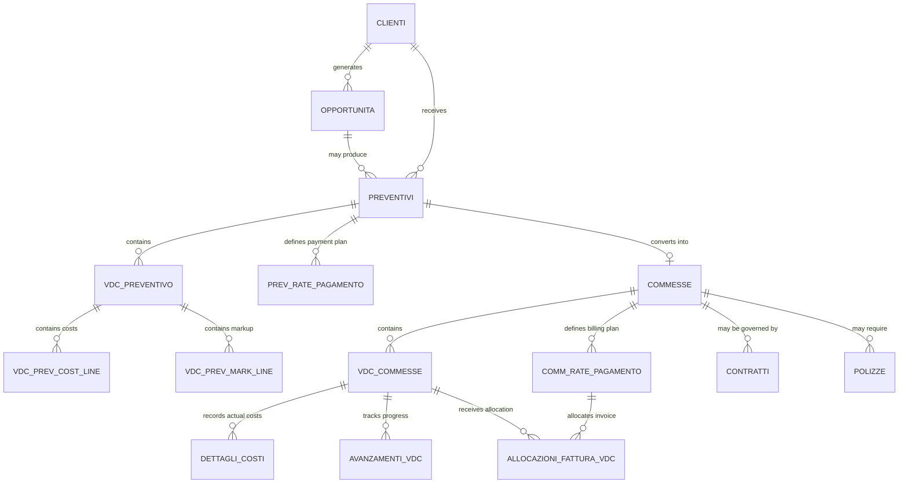

# Airtable Functional Analysis for Migration

## Scope

This document analyzes two connected Airtable bases:

- `Secured CPQ` (`app0KpNcZBMSC4ATa`)
- `Secured Commesse` (`app8B65UB03x6TsbS`)

The objective is to understand the current functional model before redesigning it as a custom relational application.

## Evidence and Limits

### Observed directly

- Table structures and field types
- Linked-record relationships visible in schema
- Formula definitions for key operational fields
- Interfaces and dashboard pages
- Sample live records from core tables
- Cross-base linkage fields and sync tables

### Not directly exposed in this plugin session

- Airtable automations, their triggers, and actions
- Scripting code and button actions behind automations
- Saved table views with filters/sorts/groupings
- User/role permissions
- Interface editability rules at field level

Where those items matter, this document labels conclusions as **inferred** rather than confirmed.

## Executive Summary

The current solution is not a single Airtable base but a two-stage operating model:

1. `Secured CPQ` manages incoming requests, opportunities, quotations, quotation line logic, pricing, and pre-project commercial validation.
2. `Secured Commesse` manages project execution, work packages, actual cost tracking, billing schedules, invoice allocation, contracts, insurance, and progress tracking.

This split is business-significant. `Secured CPQ` is the sales and quotation domain; `Secured Commesse` is the delivery and control domain. The transition from one to the other happens when a `Preventivo` is accepted and effectively becomes or generates a `Commessa`.

### Complexity assessment

- High complexity
- 42 tables across two bases
- Many computed fields
- Multiple sync/mirror tables between bases
- Strong dependence on linked records, rollups, and formulas
- Dashboards indicate the bases are used for operational reporting, not only data entry

### Main migration risks

- Business logic is spread across formulas, rollups, and likely hidden automations
- The same business concept exists in both bases through sync tables
- Several calculations compare "planned/from quote" values against "actual/in execution" values
- The project structure is hierarchical: `Commessa` -> `VDC` -> costs / billing allocations / progress
- Many fields are presentation-oriented URLs/buttons/record links and should not all become physical database columns

## Business Architecture

### Base 1: Secured CPQ

Main purpose:
Capture a request, qualify it as an opportunity, generate a quotation, model the quotation economics, and prepare downstream project creation.

Core process:

`Cliente` -> `Opportunità` -> `Preventivo` -> `Voci di computo preventivo` -> planned costs / payment schedule / expected margin -> accepted quote -> sync to `Commessa`

### Base 2: Secured Commesse

Main purpose:
Run and control the execution lifecycle of a project after acceptance, including execution work packages, billing plan, cost tracking, progress measurement, contracts, and insurance documentation.

Core process:

`Commessa` -> `VDC commesse` -> actual costs / progress / invoice allocations -> billing schedule (`comm_rate_pagamento`) -> contracts / policies / reporting

## Cross-Base Relationship

The two bases are explicitly linked by sync structures:

- `Secured CPQ.Commesse_sync`
- `Secured CPQ.Contratti_sync`
- `Secured Commesse.Clienti_sync`, `Contatti_sync`, `Ruoli_sync`, `Province_sync`
- `Secured Commesse.Commesse.preventivo_record_id`
- `Secured Commesse.Commesse.preventivo_record_link`
- `Secured CPQ.Preventivi.commesse_prev`

### Verified handoff behavior

Observed records show:

- accepted `Preventivi` in CPQ have `Convertito = "Sì"`
- accepted `Preventivi` can be linked to records in `commesse_prev`
- `Commesse` records in the delivery base store the originating `preventivo_record_id`
- `Commesse` also store a direct URL back to the source quote record in CPQ

This is strong evidence of a quote-to-project conversion process.

## Entity Inventory

### Secured CPQ

| Table | Business purpose |
| --- | --- |
| `Contatti` | Contact persons linked to customers, suppliers, opportunities, and quotes |
| `Clienti` | Customer master data for opportunities and quotations |
| `Fornitori` | Supplier master data, probably used for downstream costing and contracts |
| `Costi` | Cost catalog or service cost master used in quote line construction |
| `Attività_vdc` | Standard activity catalog used in quote work packages |
| `esclusioni` | Standard or reusable quotation exclusions |
| `Attrezzature` | Equipment list; appears peripheral in current CPQ design |
| `Opportunità` | Incoming commercial opportunities / requests |
| `Preventivi` | Quotations and their commercial/financial summary |
| `Voci di computo preventivo` | Quote work packages / scope items |
| `vdc_prev_cost_line_items` | Detailed direct-cost items for a quote work package |
| `vdc_prev_mark_line_items` | Markup lines attached to quote work packages |
| `prev_rate_pagamento` | Planned payment schedule for a quote |
| `File DB` | Generic file repository |
| `Ruoli_contatti` | Contact role dictionary |
| `Tipologia_costi` | Cost category dictionary |
| `Province` | Province reference table |
| `Mesi_anni` | Calendar support table used for reporting by month/year |
| `Contratti_sync` | Contract data mirrored for synchronization with execution base |
| `Commesse_sync` | Project data mirrored from/to execution base |
| `allocazioni_fattura_vdc` | Planned invoice allocation against quote work packages |

### Secured Commesse

| Table | Business purpose |
| --- | --- |
| `Contatti_sync` | Contacts mirrored into execution base |
| `Clienti_sync` | Customers mirrored into execution base |
| `Fornitori` | Supplier master used in execution and cost capture |
| `Tipologia_costi` | Cost category dictionary |
| `Province_sync` | Province reference data |
| `Costi` | Cost master used for actual execution costs |
| `Attività_vdc` | Standard activity catalog reused in execution |
| `Commesse` | Main project / job table |
| `vdc_commesse` | Execution work packages under each project |
| `comm_rate_pagamento` | Billing / invoice plan for each project |
| `Contratti` | Contracts linked to projects, customers, suppliers, and work packages |
| `vdc_comm_cost_line_items` | Cost estimate lines mirrored or retained at VDC level |
| `dettagli_costi` | Actual or detailed costs posted against work packages |
| `vdc_comm_mark_line_items` | Markup lines for execution work packages |
| `Mesi_anni` | Calendar support table |
| `Ruoli_sync` | Contact role dictionary mirrored from CPQ |
| `config_tarif_time` | Configuration/support table; likely experimental or internal |
| `Prova` | Test table; likely non-production |
| `Polizze` | Insurance/policy tracking linked to projects |
| `Avanzamenti_VDC` | Progress measurements on work packages |
| `Allocazioni_fattura_vdc` | Allocation of invoice values to work packages |

## Core Entity Analysis

### 1. Opportunità

Business purpose:
Tracks the incoming request before it becomes a formal quote.

Key fields:

- `Numero_interno`
- `Data ricezione`
- `Status`
- `Clienti`
- `Resp. Aziendale`
- `Resp. Cliente`
- `Tipologia`
- `Richiesta`
- `Allegato opportunità`

Important formulas:

- `Nome Opportunità` = internal number + customer + description
- `Scadenza` = `Data ricezione + 7 giorni`
- `Scaduta` marks open items as overdue unless already won/lost/cancelled/preventivata

Observed statuses:

- `Aperta`
- `Definita`
- `Stand by`
- `Preventivata`
- `Vinta`
- `Persa`
- `Annullata`

Interpretation:
This table is a pre-quotation intake and qualification register.

### 2. Preventivi

Business purpose:
Commercial quotation header with customer, financial summary, payment plan, margin, and downstream conversion state.

Key fields:

- `Numero_interno`
- `Revisione`
- `Oggetto`
- `Tipologia`
- `Clienti`
- `Stato`
- `Data Emissione`
- `Data di invio`
- `Data accettazione`
- `Voci di computo preventivo`
- `Imponibile`
- `Costi diretti`
- `Costi indiretti`
- `Margine lordo`
- `Rate di pagamento`
- `Convertito`
- `commesse_prev`

Important formulas:

- `Nome` = internal number + customer name + object
- `Scadenza` = `Data Emissione + 30 giorni`
- `Scaduto` only becomes `"Sì"` when status is `Inviato` and the deadline has passed
- `Convertito` = `"Sì"` when `Stato = Accettato`
- `Margine lordo` = `Imponibile - Costi diretti`
- `Margine lordo %` = gross margin divided by imponibile
- `Check Rate` warns when quote total differs from total planned payment schedule

Observed statuses:

- `Nuovo`
- `In elaborazione`
- `Da inviare`
- `Inviato`
- `Accettato`
- `Rifiutato`
- `Scaduto`
- `Annullato`

Interpretation:
This is the commercial master record and the main conversion point into project execution.

### 3. Voci di computo preventivo

Business purpose:
Breaks a quote into structured work packages or scope items.

Key fields:

- `Attività principale`
- `Preventivo`
- `Metodo di calcolo`
- direct cost rollups
- indirect cost %
- total revenue
- discounted revenue
- allocation alerts
- attachments and documentation links

Important formulas:

- `Descrizione` composes activity and free-text line name
- `Codice` generates a VDC code
- `voce_costi_indiretti_tot` = direct costs x indirect cost %
- `voce_costi_totale` = direct + indirect
- `Importo` depends on calculation method:
  - `Ricavo su base costi`
  - `Ricavo fisso`
- `Importo scontato` recalculates value after discount
- `Alert_Allocazione` and `Alert_Messaggio` validate whether planned invoicing is fully allocated to VDC rows

Interpretation:
This is the key bridge between commercial pricing and later execution accounting.

### 4. Commesse

Business purpose:
Main project entity in the execution base.

Key fields:

- `Numero_interno`
- `Oggetto`
- `Tipologia`
- `Committente`
- `responsabile_committente`
- `resp_commessa`
- `ref_interno`
- `Stato`
- `data_inizio_lavori`
- `data_fine_lavori`
- `CUP`
- `CIG`
- `inarcassa`
- `preventivo_record_id`
- `preventivo_record_link`
- financial and margin comparison fields

Important formulas:

- `Nome` = internal number + object
- `Numero_interno` = generated from year + progressive unless manual override is supplied
- `Scaduto` = `"In ritardo"` when end date is in the past and status is `In corso`
- several formulas compute deltas between quote baseline and actual execution values:
  - direct costs delta
  - indirect costs delta
  - total costs delta
  - effective margin delta
- `check_contratto_commessa_importo` warns when project imponibile and contract value diverge

Observed statuses:

- `Nuova`
- `In corso`
- `Stand by`
- `Completata`
- `Chiusa`
- `Archiviata`
- `Annullata`

Interpretation:
This is the operational master record after quote acceptance.

### 5. vdc_commesse

Business purpose:
Execution work packages under each project, comparable to quote VDC but enriched with actual progress, invoicing, and cost control.

Key fields:

- `Codice`
- `Descrizione`
- `Stato_vdc`
- `Commesse`
- `Attività principale`
- `Metodo di calcolo`
- planned vs actual cost and revenue fields
- billing allocation fields
- progress fields

Important formulas:

- `Codice` generates execution VDC code
- `Descrizione` composes activity + free text
- `Importo` uses the same pricing modes as the quotation VDC
- `durata_lavori` calculates working-day duration from start/end dates
- `durata_lavori_comp` compares actual duration against quoted duration
- `Residuo da fatturare` = revenue - billed amount
- `Fatturato da incassare` = billed - collected
- `Residuo da allocare` = VDC revenue - allocated billing
- `Alert_Allocazione` returns success only when nothing remains to be allocated

Observed statuses:

- `Da fare`
- `In corso`
- `Stand by`
- `Annullato`
- `Completato`

Interpretation:
This is the center of execution management and profitability control.

### 6. comm_rate_pagamento

Business purpose:
Project billing schedule and invoice register at rate/installment level.

Key fields:

- `Nome rata`
- `Tipologia`
- `Percentuale rata`
- `Importo fisso`
- `Commesse`
- `Importo Rata`
- `Stato`
- `data_fatturazione`
- `data_competenza`
- `fattura_num`
- `Allocazioni_fattura_vdc`

Important formulas:

- `codice_rata` = project internal number + installment sequence
- `Importo Rata` = fixed amount or percentage of project amount
- `Importo da allocare` = invoice amount minus allocated amount
- `Alert_Allocazione_Rata` validates full allocation
- `Rata_vs_Totale_Allocato` flags over-allocation

Observed statuses:

- `Nuovo`
- `Previsto`
- `Da autorizzare`
- `Da fatturare`
- `Fatturato`
- `Incassato`
- `Annullato`

Interpretation:
The table acts both as payment plan and invoice lifecycle tracker.

### 7. dettagli_costi

Business purpose:
Detailed cost postings at execution level, linked to VDC and optionally suppliers/contracts.

Key fields:

- `Descrizione costo`
- `Costi`
- `Quantità`
- direct cost components
- `Total`
- `Fornitori`
- `data_costo`
- `vdc_commesse`
- `da_prev`

Interpretation:
This appears to be the detailed actual-cost ledger used to compare operational reality against planned quote values.

### 8. Contratti

Business purpose:
Tracks signed contracts associated with one or more commesse.

Key fields:

- `Numero_contratto`
- `Cliente`
- `Fornitori`
- `Valore`
- `Data firma`
- `Data inizio`
- `Data scadenza`
- `Status`
- `vdc_commesse`
- attachments

Interpretation:
Contract data is operationally relevant and tied into both project and VDC analysis.

## Detailed Field Matrices

This section adds the field-level detail requested for the main entities. For every table below:

- `Type` is the Airtable value type
- `Required` means "appears operationally necessary"; Airtable required/not-required rules were not directly exposed
- `Calculation / meaning` explains the logic when the field is computed

### Secured CPQ - `Opportunità`

| Field | Type | Required | Calculation / meaning |
| --- | --- | --- | --- |
| `Nome Opportunità` | Formula | Yes | Concatenates internal number, customer, and opportunity description to build the display name. |
| `anno_creazione` | Formula | No | Derived year used for numbering/reporting. |
| `Anno_creazione_manual_inpurt` | Single line text | No | Manual override/support field for year handling. |
| `number_for_assignment` | Number | Yes | Progressive number used in internal numbering. |
| `Numero_interno` | Single line text | Yes | Business-facing internal opportunity code. |
| `numero_libero_oppy` | Single line text | No | Manual/free numbering alternative. |
| `Descrizione Opportunità` | AI text | No | AI-generated summary text from the request context. |
| `Data ricezione` | Date | Yes | Date the request was received. |
| `Richiesta` | Rich text | Yes | Source request or customer brief. |
| `Data invio prev` | Date | No | Date the related quote was sent. |
| `Data vinta` | Date | No | Date the opportunity was won. |
| `Status` | Single select | Yes | Lifecycle status: `Aperta`, `Definita`, `Stand by`, `Preventivata`, `Vinta`, `Persa`, `Annullata`. |
| `Scadenza` | Formula | Yes | Calculates deadline as `Data ricezione + 7 days`. |
| `Scaduta` | Formula | Yes | Returns `"Sì"` when still active and deadline has passed; `"No"` otherwise. |
| `Clienti` | Multiple record links | Yes | Linked customer(s). |
| `Telefono` | Lookup | No | Pulled from linked customer/contact data. |
| `Email` | Lookup | No | Pulled from linked customer/contact data. |
| `[o]Resp. Aziendale` | Multiple record links | Yes | Assigned internal owner. |
| `ref_interno_oppy` | Multiple record links | No | Internal reference contact(s). |
| `[o]Resp. Cliente` | Multiple record links | No | Customer-side contact. |
| `[o]Preventivi` | Multiple record links | No | Quote(s) generated from the opportunity. |
| `Allegato opportunità` | Multiple attachments | No | Request attachments. |
| `button_oppy` | Button | No | UI action to open or manage the record. |
| `link oppy` | Formula | No | Generates an Airtable/open link. |
| `Tipologia` | Single select | Yes | High-level category such as `Laboratorio` or `Progettazione`. |
| `Numero_auto` | Auto number | Yes | Internal system-generated sequence. |
| `Assignee` | Single collaborator | No | Operational assignee. |

### Secured CPQ - `Preventivi`

| Field | Type | Required | Calculation / meaning |
| --- | --- | --- | --- |
| `Nome` | Formula | Yes | Concatenates internal number, customer name, and object. |
| `Numero_interno` | Single line text | Yes | Main quote number. |
| `number_for_assignment` | Number | Yes | Progressive sequence used for numbering. |
| `Numero_libero_prev` | Single line text | No | Manual/free numbering alternative. |
| `anno_creazione` | Formula | No | Derived year used for numbering/reporting. |
| `Revisione` | Number | Yes | Quote revision number. |
| `Oggetto` | Single line text | Yes | Quote subject. |
| `Tipologia` | Multiple selects | Yes | Service categories covered by the quote. |
| `Stima durata lavori_gg` | Rollup | No | Aggregated planned duration from linked quote work packages. |
| `Clienti` | Multiple record links | Yes | Linked customer(s). |
| `[o]Attenzione_di` | Multiple record links | No | Attention/contact person for the quote. |
| `[o]Esecutore` | Multiple record links | Yes | Internal executor / quotation owner. |
| `Stato` | Single select | Yes | Quote status: `Nuovo`, `In elaborazione`, `Da inviare`, `Inviato`, `Accettato`, `Rifiutato`, `Scaduto`, `Annullato`. |
| `Data Emissione` | Date | Yes | Quote issue date. |
| `Data di invio` | Date | No | Date sent to client. |
| `Scadenza` | Formula | Yes | Calculates expiry date as `Data Emissione + 30 days`. |
| `Scaduto` | Formula | Yes | Returns `"Sì"` only when quote is `Inviato` and expired; otherwise `"No"`. |
| `Data accettazione` | Date | No | Date accepted by client. |
| `Data approvazione` | Date | No | Approval date, if separate from acceptance. |
| `Convertito` | Formula | Yes | Returns `"Sì"` when `Stato = Accettato`, otherwise `"No"`. |
| `cassa_di_previdenza` | Checkbox | No | Applies additional professional contribution logic. |
| `Allegato` | Multiple attachments | No | Quote documents. |
| `Note` | Multiline text | No | Internal notes. |
| `Voci di computo preventivo` | Multiple record links | Yes | Linked quote work packages. |
| `[i]Imponibile` | Rollup | Yes | Total quote revenue/imponibile from linked VDC rows. |
| `[i]v_d_c_calc_totale_margine Rollup` | Rollup | Yes | Aggregated net margin from work packages. |
| `[o]v_d_c_tot_marg_perc` | Formula | Yes | Margin percentage derived from quote financial totals. |
| `Perc_Markup` | Percent | No | Markup percentage applied at quote level. |
| `perc_markup_valore` | Formula | No | Converts quote-level markup percentage into amount logic. |
| `Importo Markup` | Currency | No | Markup value stored at quote level. |
| `importo_markup_perc_valore` | Formula | No | Recalculates markup percentage from amount and imponibile. |
| `Margine lordo` | Formula | Yes | `Imponibile - direct costs`. |
| `Margine lordo perc` | Formula | Yes | Gross margin divided by imponibile, shown as text percentage. |
| `Count vdc` | Count / Formula support | No | Counts linked quote work packages. |
| `prev_rate_pagamento` | Multiple record links | No | Planned payment schedule lines. |
| `Check Rate` | Formula | Yes | Warns when quote total and total payment schedule do not reconcile. |
| `Totale Rate di pagamento` | Rollup | No | Total scheduled payment amount. |
| `Record ID` | Formula | Yes | Stores Airtable record ID in field form. |
| `Proventivo_record_link` | Formula | No | Generates a direct link to the quote record. |
| `link_documentazione` | URL | No | External documentation link. |
| `esclusioni_free_text` | Multiline text | No | Free-text exclusions clause. |
| `link_preventivo` | URL | No | Quote output/document link. |
| `link_email_preventivo` | URL | No | Prebuilt quote email link. |
| `Esclusioni` | Multiple record links | No | Structured exclusions linked from exclusions table. |
| `commesse_prev` | Multiple record links | No | Linked project records created from accepted quote. |
| `Sconto_perc` | Percent | No | Discount percentage. |
| `Sconto_perc_valore` | Formula | No | Converts discount percentage into amount. |
| `Sconto Importo` | Currency | No | Discount as fixed amount. |
| `Sconto Importo valore_perc` | Formula | No | Converts discount amount into percentage effect. |

### Secured CPQ - `Voci di computo preventivo`

| Field | Type | Required | Calculation / meaning |
| --- | --- | --- | --- |
| `Descrizione` | Formula | Yes | Builds display description from linked activity and optional free text. |
| `Nome vdc libero` | Single line text | No | Free text title when no standard activity is selected. |
| `[o]Attività_principale_vdc` | Multiple record links | No | Linked standard activity. |
| `Codice` | Formula | Yes | Generates a VDC code using auto number and quote identifier. |
| `[o]Preventivo` | Multiple record links | Yes | Parent quote. |
| `v_d_c_cost_direct_tot` | Rollup | Yes | Total direct costs from linked detailed cost lines. |
| `voce_costi_indiretti_perc` | Percent | Yes | Indirect cost percentage applied to direct costs. |
| `voce_costi_indiretti_tot` | Formula | Yes | Calculates indirect cost amount as direct costs x indirect cost %. |
| `voce_costi_totale` | Formula | Yes | Total cost = direct costs + indirect costs. |
| `Metodo di calcolo` | Single select | Yes | Revenue logic: fixed revenue or cost-based revenue. |
| `Importo` | Formula | Yes | Calculates revenue using the selected method. |
| `Importo scontato` | Formula | No | Revenue after applying discount logic. |
| `sconto_vdc` | Currency | No | Discount amount at work-package level. |
| `sconto_perc_vdc` | Percent | No | Discount percentage at work-package level. |
| `Stima durata lavori` | Number | No | Planned duration for the work package. |
| `allocazioni_fattura_vdc` | Multiple record links | No | Planned invoice allocations. |
| `Importo allocato Rollup` | Rollup | No | Total amount allocated from planned invoices. |
| `Alert_Allocazione` | Formula | Yes | Returns success/warning depending on whether allocation matches discounted amount. |
| `Alert_Messaggio` | Formula | Yes | Human-readable warning when allocation is not complete or correct. |
| `Dettaglio Servizi` | Multiple record links | No | Linked service-detail records. |
| `Descrizione rielaborata vdc` | AI text | No | AI-generated reworked description. |
| `Brief voce di computo` | Multiline text | No | Work package brief. |
| `Allegati` | Multiple attachments | No | Supporting attachments. |
| `Link documentazione` | URL | No | External supporting documentation. |
| `Margine lordo` | Formula / Rollup support | No | Gross margin calculation at work-package level. |
| `Margine lordo %` | Formula | No | Gross margin percentage for the work package. |
| `Costi diretti %` | Formula | No | Share of direct costs in revenue. |
| `Costi totali %` | Formula | No | Share of total costs in revenue. |
| `Costi indiretti %` | Formula | No | Share of indirect costs in revenue. |

### Secured CPQ - `vdc_prev_cost_line_items`

| Field | Type | Required | Calculation / meaning |
| --- | --- | --- | --- |
| `Descrizione (Note)` | Single line text | Yes | Description of the detailed cost line. |
| `Tipologia_servizi` | Multiple record links | No | Linked cost category. |
| `Servizio` | Multiple record links | Yes | Linked cost/service master item. |
| `Unita_di_misura` | Lookup | No | Pulled from linked service master. |
| `qty` | Number | Yes | Quantity used in the cost line. |
| `vdc_prev_costo_manod` | Currency | No | Labour cost amount. |
| `vdc_prev_costo_mater` | Currency | No | Material cost amount. |
| `vdc_prev_costo_subap` | Currency | No | Subcontracting cost amount. |
| `vdc_prev_costo_altro` | Currency | No | Other cost amount. |
| `subtot` | Formula | Yes | Intermediate subtotal for the line. |
| `Totale Linea` | Formula | Yes | Final line total amount. |
| `[o]Voce di computo (preventivo)` | Multiple record links | Yes | Parent quote work package. |

### Secured CPQ - `prev_rate_pagamento`

| Field | Type | Required | Calculation / meaning |
| --- | --- | --- | --- |
| `numid` | Auto number | Yes | Internal sequence. |
| `Nome_rata_completo` | Formula | Yes | Composes full installment label. |
| `Nome rata` | Single select | Yes | Installment type/name. |
| `Descrizione` | Single line text | No | Installment description. |
| `Tipologia` | Single select | Yes | Fixed amount vs percentage. |
| `Percentuale rata` | Percent | No | Percentage of quote amount when percentage mode is used. |
| `Importo fisso rata` | Currency | No | Fixed amount when fixed mode is used. |
| `scadenza` | Single select | No | Billing term / deadline rule. |
| `Preventivi` | Multiple record links | Yes | Parent quote. |
| `Importo Rata` | Formula | Yes | Calculates the installment value from quote amount and type. |
| `allocazioni_fattura_vdc` | Multiple record links | No | Allocations of this installment to quote work packages. |
| `Totale allocato` | Rollup | No | Total value allocated to work packages. |
| `Rata_vs_Totale_Allocato` | Formula | Yes | Warns when allocated total exceeds installment amount. |
| `Alert_Allocazione_Rata` | Formula | Yes | Returns success/warning depending on whether installment is fully allocated. |

### Secured Commesse - `Commesse`

| Field | Type | Required | Calculation / meaning |
| --- | --- | --- | --- |
| `Nome` | Formula | Yes | Concatenates project internal number and object. |
| `Numero_interno` | Formula | Yes | Builds project number from year and progressive, unless manual override exists. |
| `numero_interno_libero` | Single line text | No | Manual/free project number. |
| `number_for_assignment` | Number | Yes | Progressive sequence for numbering. |
| `anno_creazione_manual` | Number | No | Manual override for creation year. |
| `anno_creazione` | Formula | Yes | Derived year of project creation. |
| `Oggetto` | Single line text | Yes | Project object/description. |
| `Tipologia` | Multiple selects | Yes | Service categories of the project. |
| `Committente` | Multiple record links | Yes | Customer/contracting entity. |
| `TipoCommittente` | Lookup | No | Pulled from customer master. |
| `inarcassa` | Checkbox | No | Indicates professional contribution applicability. |
| `Durata lavori_gg` | Rollup | No | Planned duration aggregated from VDC rows. |
| `Durata lavori_gg_da_prev` | Rollup | No | Planned duration inherited from quote baseline. |
| `durata_lavori_gg_comp` | Formula | No | Variance between actual/planned duration. |
| `responsabile_committente` | Multiple record links | No | Client-side responsible person. |
| `resp_commessa` | Multiple record links | Yes | Internal project manager. |
| `ref_interno` | Multiple record links | No | Additional internal references. |
| `Stato` | Single select | Yes | Project lifecycle status. |
| `data_creazione` | Created time | Yes | System creation date. |
| `data_modifica` | Last modified time | Yes | System last modification date. |
| `date_status_changed` | Last modified time | No | Last status change timestamp. |
| `data_inizio_lavori` | Date | No | Execution start date. |
| `data_fine_lavori` | Date | No | Execution end date. |
| `data_chiusura` | Date | No | Final closure date. |
| `Scaduto` | Formula | Yes | Returns `In ritardo` when end date has passed and status is `In corso`, else `Nei tempi`. |
| `voce_di_computo_comm` | Multiple record links | Yes | Linked execution work packages. |
| `v_d_c_cost_direct_tot_da_prev` | Rollup | Yes | Baseline direct costs copied from quote. |
| `v_d_c_cost_direct_tot` | Rollup | Yes | Current direct costs from execution data. |
| `v_d_c_cost_direct_comp` | Formula | Yes | Difference between quote direct costs and execution direct costs. |
| `voce_costi_indiretti_tot_da_prev` | Rollup | Yes | Baseline indirect costs from quote. |
| `voce_costi_indiretti_tot` | Rollup | Yes | Current indirect costs from execution data. |
| `voce_cost_indiretti_comp` | Formula | Yes | Delta between baseline and current indirect costs. |
| `v_d_c_cost_totale_linea_da_prev` | Formula | Yes | Baseline total costs from quote side. |
| `v_d_c_cost_totale_linea Rollup` | Rollup | Yes | Current total work-package costs. |
| `v_d_c_cost_totale_comp` | Formula | Yes | Difference between baseline and current total costs. |
| `imponibile_da_prev` | Rollup | Yes | Baseline revenue from accepted quote. |
| `[i]Imponibile` | Rollup | Yes | Current project revenue / imponibile. |
| `[i]v_d_c_calc_totale_margine_comm` | Rollup | Yes | Current net margin from execution VDC rows. |
| `[i]v_d_c_calc_totale_margine_effetivo` | Rollup | Yes | Effective net margin considering billed/realized values. |
| `margine_netto_eff_tot_comp` | Formula | Yes | Delta between expected and effective net margin. |
| `margine_netto_eff_perc` | Formula | Yes | Effective net margin percentage. |
| `Perc_Markup` | Percent | No | Project-level markup percentage. |
| `Importo Markup` | Currency | No | Project-level markup amount. |
| `Margine_lordo` | Formula | Yes | Project gross margin. |
| `Margine_lordo_eff` | Formula | Yes | Effective gross margin. |
| `Margine_lordo_comp` | Formula | Yes | Difference between planned and actual gross margin. |
| `Margine_lordo_perc` | Formula | Yes | Gross margin percentage. |
| `Margine_lordo_eff_perc` | Formula | Yes | Effective gross margin percentage. |
| `Margine_lordo_perc_comp` | Formula | Yes | Delta between planned and effective gross margin percentages. |
| `Count vdc` | Count | No | Number of execution work packages. |
| `comm_pagamento` | Multiple record links | No | Billing schedule rows. |
| `Check Rate` | Formula | Yes | Warns when project amount and payment plan total do not match. |
| `Totale Rate di pagamento` | Rollup | No | Total scheduled billing value. |
| `Totale_rate_fatturate` | Rollup | No | Total billed amount. |
| `Totale_rate_non_fatturate` | Formula | No | Remaining to bill. |
| `preventivo_record_id` | Single line text | Yes | Stores originating quote record ID. |
| `preventivo_nome` | Single line text | No | Stores originating quote name. |
| `preventivo_record_link` | URL | No | Direct link back to quote. |
| `Clickup_link` | URL | No | External ClickUp link for project management. |
| `CUP` | Single line text | No | Public procurement/project code. |
| `CIG` | Single line text | No | Procurement tender code. |
| `Polizze` | Multiple record links | No | Related insurance policies. |
| `check_contratto_commessa_importo` | Formula | Yes | Warns if contract value and project expected value differ materially. |

### Secured Commesse - `vdc_commesse`

| Field | Type | Required | Calculation / meaning |
| --- | --- | --- | --- |
| `Codice` | Formula | Yes | Generates execution VDC code from sequence and project identifier. |
| `Descrizione` | Formula | Yes | Builds description from linked activity and optional free text. |
| `Nome vdc libero` | Single line text | No | Free-text title for non-standard work package. |
| `Stato_vdc` | Single select | Yes | VDC status: `Da fare`, `In corso`, `Stand by`, `Annullato`, `Completato`. |
| `Commesse` | Multiple record links | Yes | Parent project. |
| `[o]Attività_principale_vdc` | Multiple record links | No | Linked standard activity. |
| `Importo_da_prev` | Currency | Yes | Revenue baseline copied from quote. |
| `Metodo di calcolo` | Single select | Yes | Revenue logic: fixed revenue or cost-based revenue. |
| `v_d_c_cost_direct_tot` | Rollup | Yes | Current direct costs. |
| `v_d_c_cost_direct_tot_da_prev` | Rollup | Yes | Baseline direct costs from quote. |
| `voce_costi_indiretti_perc` | Percent | Yes | Indirect cost percentage. |
| `voce_costi_indiretti_tot` | Formula | Yes | Current indirect costs. |
| `voce_costi_indiretti_tot_da_prev` | Currency | Yes | Baseline indirect costs. |
| `voce_costi_totale` | Formula | Yes | Current total costs = direct + indirect. |
| `voce_costi_totale_da_prev` | Formula | Yes | Baseline total costs. |
| `Importo` | Formula | Yes | Current revenue amount based on pricing method. |
| `importo_comp` | Formula | Yes | Difference between baseline revenue and current revenue. |
| `durata_lavori` | Formula | No | Working-day duration between start and end dates. |
| `durata_lavori_da_prev` | Number | No | Planned duration copied from quote. |
| `durata_lavori_comp` | Formula | No | Difference between planned and current duration. |
| `Dettaglio Servizi` | Multiple record links | No | Linked actual cost/detail entries. |
| `Avanzamenti_VDC` | Multiple record links | No | Linked progress updates. |
| `Allocazioni_fattura_vdc` | Multiple record links | No | Invoice allocations to this work package. |
| `Maturato vdc` | Rollup | No | Amount matured through progress entries. |
| `Totale vdc fatturato` | Rollup | No | Amount billed on this work package. |
| `Totale vdc incassato` | Rollup | No | Amount collected on this work package. |
| `Residuo da fatturare` | Formula | Yes | Current revenue minus billed amount. |
| `Fatturato da incassare` | Formula | Yes | Billed minus collected. |
| `Residuo vdc da incassare` | Formula | Yes | Collected gap at VDC level. |
| `Total vdc allocato` | Rollup | No | Total invoice value allocated to this work package. |
| `Residuo da allocare` | Formula | Yes | Current revenue minus allocated value. |
| `Allocato non fatturato` | Formula | Yes | Allocated but not yet billed value. |
| `Alert_Allocazione` | Formula | Yes | Returns success when residual to allocate is zero or VDC is cancelled; warning otherwise. |

### Secured Commesse - `comm_rate_pagamento`

| Field | Type | Required | Calculation / meaning |
| --- | --- | --- | --- |
| `codice_rata` | Formula | Yes | Builds installment code from project number and row sequence. |
| `id` | Auto number | Yes | Internal technical sequence. |
| `Nome rata` | Single select | Yes | Billing stage such as `Acconto`, `SAL`, `Saldo`. |
| `Descrizione` | Single line text | No | Billing line description. |
| `Tipologia` | Single select | Yes | Fixed amount or percentage. |
| `Percentuale rata` | Percent | No | Percentage used when billing is percentage-based. |
| `Importo fisso` | Currency | No | Fixed amount used when billing is fixed. |
| `scadenza` | Single select | No | Payment/deadline rule. |
| `data_scadenza_personalizzata` | Date | No | Manual due date override. |
| `Commesse` | Multiple record links | Yes | Parent project. |
| `Importo Rata` | Formula | Yes | If fixed: use fixed amount; if percentage: project amount x percentage. |
| `data_fatturazione` | Date | No | Invoice date. |
| `data_competenza` | Date | No | Accounting/competence date. |
| `fattura_num` | Single line text | No | Invoice number. |
| `Stato` | Single select | Yes | Billing lifecycle status. |
| `Allocazioni_fattura_vdc` | Multiple record links | No | Allocations to execution work packages. |
| `Totale allocato VDC` | Rollup | No | Total installment amount allocated to VDC rows. |
| `Importo da allocare` | Formula | Yes | Installment amount minus allocated total. |
| `Percentuale allocato` | Formula | Yes | Share of installment already allocated. |
| `Alert_Allocazione_Rata` | Formula | Yes | Returns success when fully allocated; warning otherwise. |
| `Rata_vs_Totale_Allocato` | Formula | Yes | Warning when allocated amount exceeds installment amount. |

### Secured Commesse - `dettagli_costi`

| Field | Type | Required | Calculation / meaning |
| --- | --- | --- | --- |
| `Descrizione costo` | Single line text | Yes | Actual cost description. |
| `Costi` | Multiple record links | Yes | Linked cost master item. |
| `Quantità` | Number | Yes | Quantity consumed or booked. |
| `Costo Manodop.` | Currency | No | Labour cost amount. |
| `Costo Mater.` | Currency | No | Material cost amount. |
| `Costo Subap.` | Currency | No | Subcontracting cost amount. |
| `Costo Altro` | Currency | No | Other cost amount. |
| `Total` | Formula | Yes | Total cost amount for the row. |
| `Fornitori` | Multiple record links | No | Linked supplier(s). |
| `data_costo` | Date | No | Cost occurrence date. |
| `data_creazione` | Created time | Yes | Creation timestamp. |
| `vdc_commesse` | Multiple record links | Yes | Linked execution work package. |
| `da_prev` | Checkbox | No | Marks imported/planned cost vs actual operational cost. |
| `rel_contratto` | Multiple record links | No | Related contract(s), if applicable. |
| `Calculation` | Formula | No | Internal derived control field. |

### Secured Commesse - `Contratti`

| Field | Type | Required | Calculation / meaning |
| --- | --- | --- | --- |
| `Name` | Single line text | Yes | Contract name. |
| `commesse_contratto` | Multiple record links | Yes | Linked project(s). |
| `Numero_contratto` | Single line text | Yes | Business contract number. |
| `Numero_contratto_libero` | Single line text | No | Manual/free numbering field. |
| `Data firma` | Date | Yes | Signature date. |
| `Cliente` | Multiple record links | No | Linked customer(s). |
| `Fornitori` | Multiple record links | No | Linked supplier(s). |
| `Valore` | Currency | Yes | Contract value. |
| `Data inizio` | Date | No | Start date. |
| `Data scadenza` | Date | No | Expiry date. |
| `anno_firma` | Formula | No | Derived year of signature. |
| `Status` | Single select | Yes | Contract status. |
| `vdc_commesse` | Multiple record links | No | Work packages governed by this contract. |
| `rollup_costi_contratto` | Rollup | No | Aggregated contract-related costs. |
| `rate_contratto` | Multiple record links | No | Contract-related rate rows. |
| `RecordId_contract` | Formula | Yes | Stores Airtable record ID in field form. |
| `cliente_o_fornitore` | Formula | No | Derived text describing whether contract is on customer or supplier side. |
| `allegati` | Multiple attachments | No | Contract documents. |

### Secured Commesse - `Polizze`

| Field | Type | Required | Calculation / meaning |
| --- | --- | --- | --- |
| `Codice_polizza` | Formula | Yes | Concatenates insurer and policy number. |
| `Numero_polizza` | Single line text | Yes | Policy number. |
| `Descrizione` | Single line text | No | Policy description. |
| `Compagnia` | Single select | Yes | Insurance company. |
| `Durata_Polizza` | Number | No | Policy duration. |
| `Data_stipula` | Date | Yes | Policy start/signature date. |
| `Data_rinnovo` | Date | No | Renewal date. |
| `Data_scadenza` | Formula | Yes | Derived expiry date from start/renewal and duration logic. |
| `Data_estinzione` | Date | No | Closure/extinction date. |
| `Status` | Formula | Yes | Derived current status of the policy. |
| `Alert` | Formula | Yes | Warning/alert indicator for upcoming or problematic status. |
| `Importo` | Currency | No | Policy value/premium. |
| `Polizza_Commessa` | Multiple record links | Yes | Linked project(s). |
| `Tipologia` | Multiple selects | No | Policy type such as `Commessa` or `Gara`. |
| `Polizza_Allegato` | Multiple attachments | No | Policy files. |
| `Ricevuta` | Multiple attachments | No | Payment receipt. |
| `Ricevuta svincolo` | Multiple attachments | No | Release/discharge receipt. |

### Secured Commesse - `Avanzamenti_VDC`

| Field | Type | Required | Calculation / meaning |
| --- | --- | --- | --- |
| `Name` | Formula | Yes | Generated label for the progress record. |
| `Data registrazione` | Date | Yes | Date the progress was recorded. |
| `Valore avanzamento` | Percent | Yes | Progress percentage for the work package. |
| `Delta avanzamento` | Percent | No | Incremental progress compared with previous state. |
| `Voce di computo` | Multiple record links | Yes | Linked execution work package. |
| `Importo maturato recente` | Formula | Yes | Revenue matured in the latest progress movement. |
| `Importo maturato periodo` | Formula | Yes | Revenue matured in the selected period. |
| `Importo maturato totale` | Formula | Yes | Cumulative matured revenue. |
| `Importo residuo` | Formula | Yes | Remaining revenue still to mature. |
| `Note` | Multiline text | No | Notes on progress update. |
| `Data creazione` | Created time | Yes | System creation timestamp. |

### Supporting and sync tables

The remaining tables are mainly dictionaries, master-data mirrors, or technical sync structures. Their field patterns are simpler:

- `Contatti`, `Contatti_sync`
  - mostly text/contact fields, linked roles, linked customers, phone, email, and record-link helpers
- `Clienti`, `Clienti_sync`
  - mostly customer master data: legal name, VAT/tax identifiers, address, province, PEC/email, Mexal references, linked contacts, linked projects/contracts
- `Fornitori`
  - supplier equivalent of customer master data
- `Costi`
  - service/cost catalog with unit of measure and component costs (`manodopera`, `materiale`, `subappalto`, `altro`)
- `Attività_vdc`
  - standard activity dictionary with title, description, service category, and folder/document links
- `Tipologia_costi`, `Ruoli_contatti`, `Ruoli_sync`, `Province`, `Province_sync`, `Mesi_anni`
  - reference tables used for categorization and reporting
- `Commesse_sync`, `Contratti_sync`
  - mirrored copies carrying key identifiers, statuses, financial baseline fields, quote links, and transport fields used for cross-base synchronization
- `vdc_prev_mark_line_items`, `vdc_comm_mark_line_items`
  - markup lines storing markup values and totals at VDC level
- `allocazioni_fattura_vdc`, `Allocazioni_fattura_vdc`
  - allocation tables connecting planned/actual invoice rows to VDC rows, with formula checks for consistency

## Field Catalog Table View

The following catalog uses the requested table-view format. Formula rows explain the input values and the conditions used by the calculation.

### Secured CPQ - `Contatti`

| Key field name | Field type | Description and explanation | Formula values and conditions |
| --- | --- | --- | --- |
| `Nome Completo` | Formula | Primary display name for the contact. | Combines title/name/surname fields into one display value. |
| `Titolo` | Single line text | Contact title. | Not a formula. |
| `Nome` | Single line text | First name. | Not a formula. |
| `Cognome` | Single line text | Last name. | Not a formula. |
| `Clienti` | Multiple record links | Customer(s) this contact belongs to. | Not a formula. |
| `[o]Ruoli` | Multiple record links | Contact role(s). | Not a formula. |
| `Telefono` | Phone number | Contact phone. | Not a formula. |
| `Email` | Email | Contact email. | Not a formula. |
| `Preventivi` | Multiple record links | Quotes where this contact is involved. | Not a formula. |
| `Contact_record_link_formula` | Formula | Direct record link for UI/navigation. | Builds a URL using the Airtable record ID. |
| `recordId` | Formula | Stores the Airtable record ID as a visible field. | Returns the current Airtable record ID. |

### Secured CPQ - `Clienti`

| Key field name | Field type | Description and explanation | Formula values and conditions |
| --- | --- | --- | --- |
| `Ragione Sociale / Denominazione` | Single line text | Customer legal/company name. | Not a formula. |
| `IdCommittente` | Formula | Business customer identifier. | Derived from internal numbering/customer reference logic. |
| `ac_record_id` | Auto number | Airtable progressive number. | System generated. |
| `[i]preventivo_link` | Multiple record links | Related quote records. | Not a formula. |
| `Commesse` | Multiple record links | Related project records. | Not a formula. |
| `Partita Iva` | Single line text | VAT number. | Not a formula. |
| `CodiceFiscale` | Single line text | Tax code. | Not a formula. |
| `TipoCommittente` | Single select | Customer category. | Not a formula. |
| `Telefono` | Phone number | Customer phone. | Not a formula. |
| `email` | Email | Customer email. | Not a formula. |
| `Indirizzo`, `Località`, `CAP` | Single line text | Customer address fields. | Not formulas. |
| `Provincia` | Multiple record links | Linked province reference. | Not a formula. |
| `Codice_prov` | Lookup | Province code from linked province. | Lookup from `Province`. |
| `Cliente_record_link` | Formula | Direct customer record link. | Builds URL using record ID. |
| `recordId` | Formula | Stores Airtable record ID. | Returns the current Airtable record ID. |

### Secured CPQ - `Fornitori`

| Key field name | Field type | Description and explanation | Formula values and conditions |
| --- | --- | --- | --- |
| `Ragione Sociale / Denominazione` | Single line text | Supplier legal/company name. | Not a formula. |
| `IdFornitore` | Formula | Supplier business identifier. | Derived from supplier numbering/reference logic. |
| `ac_record_id` | Auto number | Airtable progressive number. | System generated. |
| `Partita Iva` | Single line text | VAT number. | Not a formula. |
| `CodiceFiscale` | Single line text | Tax code. | Not a formula. |
| `TipoFornitore` | Single select | Supplier category. | Not a formula. |
| `[o]Referenti` | Multiple record links | Supplier contacts. | Not a formula. |
| `[i]preventivo_link` | Multiple record links | Quotes connected to supplier. | Not a formula. |
| `Contratti_sync` | Multiple record links | Synced contracts involving supplier. | Not a formula. |
| `Cliente_record_link` | Formula | Direct Airtable link to supplier/customer-style record. | Builds URL using record ID. |

### Secured CPQ - `Costi`

| Key field name | Field type | Description and explanation | Formula values and conditions |
| --- | --- | --- | --- |
| `Name` | Single line text | Cost/service name. | Not a formula. |
| `Tipologia servizio` | Multiple record links | Linked cost category. | Not a formula. |
| `Qta default` | Number | Default quantity. | Not a formula. |
| `Unita_di_misura` | Single select | Unit of measure. | Not a formula. |
| `Costo Manod.` | Currency | Labour cost component. | Not a formula. |
| `Costo Mater.` | Currency | Material cost component. | Not a formula. |
| `Costo Subap.` | Currency | Subcontractor cost component. | Not a formula. |
| `Costo Altro` | Currency | Other cost component. | Not a formula. |
| `Costo %` | Percent | Percentage cost component. | Not a formula. |
| `QuoteLineItemsV2` | Multiple record links | Quote line items using this cost. | Not a formula. |
| `recordId` | Formula | Stores Airtable record ID. | Returns the current Airtable record ID. |

### Secured CPQ - `Attività_vdc`

| Key field name | Field type | Description and explanation | Formula values and conditions |
| --- | --- | --- | --- |
| `Name` | Single line text | Standard activity name. | Not a formula. |
| `Id` | Single line text | Activity code. | Not a formula. |
| `Descrizione` | Rich text | Activity description. | Not a formula. |
| `Servizio` | Single select | Service category. | Not a formula. |
| `[o]attivita_secondaria` | Multiple record links | Secondary activity relations. | Not a formula. |
| `[i]attivita_princip_vdc` | Multiple record links | Quote work packages using this activity. | Not a formula. |
| `Descrizione Completa con titolo` | Formula | Full activity description with title. | Combines activity title and description. |
| `gdrive_folder_id` | Single line text | Google Drive folder ID. | Not a formula. |
| `gdrive_folder_link` | URL | Google Drive folder URL. | Not a formula. |
| `recordID_attivita` | Formula | Activity record ID. | Returns Airtable record ID. |

### Secured CPQ - `Opportunità`

| Key field name | Field type | Description and explanation | Formula values and conditions |
| --- | --- | --- | --- |
| `Nome Opportunità` | Formula | Opportunity display name. | Concatenates `Numero_interno`, `Clienti`, and `Descrizione Opportunità`. |
| `anno_creazione` | Formula | Reporting/numbering year. | Extracts or derives year used by opportunity numbering. |
| `number_for_assignment` | Number | Progressive number used in internal assignment. | Not a formula. |
| `Numero_interno` | Single line text | Business opportunity number. | Not a formula. |
| `Descrizione Opportunità` | AI text | AI-generated opportunity description. | AI-generated from source request context. |
| `Data ricezione` | Date | Date request was received. | Not a formula. |
| `Richiesta` | Rich text | Original customer request. | Not a formula. |
| `Data invio prev` | Date | Date quote was sent. | Not a formula. |
| `Data vinta` | Date | Date opportunity was won. | Not a formula. |
| `Status` | Single select | Opportunity lifecycle. | Values include `Aperta`, `Definita`, `Stand by`, `Preventivata`, `Vinta`, `Persa`, `Annullata`. |
| `Scadenza` | Formula | Response deadline. | If `Data ricezione` exists, calculates `Data ricezione + 7 days`; otherwise blank. |
| `Scaduta` | Formula | Overdue flag. | Returns `No` if status is terminal (`Preventivata`, `Persa`, `Vinta`, `Annullata`). For active statuses, returns `Sì` when deadline is before today. |
| `Clienti` | Multiple record links | Linked customer. | Not a formula. |
| `[o]Resp. Aziendale` | Multiple record links | Internal commercial owner. | Not a formula. |
| `[o]Resp. Cliente` | Multiple record links | Customer-side responsible contact. | Not a formula. |
| `[o]Preventivi` | Multiple record links | Quotes generated from the opportunity. | Not a formula. |
| `Record ID` | Formula | Airtable source record ID. | Returns the record ID. |
| `link oppy` | Formula | Direct record link. | Builds Airtable URL from base/page context and record ID. |

### Secured CPQ - `Preventivi`

| Key field name | Field type | Description and explanation | Formula values and conditions |
| --- | --- | --- | --- |
| `Nome` | Formula | Quote display name. | Concatenates `Numero_interno`, customer name lookup, and `Oggetto`. |
| `Numero_interno` | Single line text | Quote business number. | Not a formula. |
| `number_for_assignment` | Number | Progressive assignment number. | Not a formula. |
| `Numero_libero_prev` | Single line text | Manual/free quote number. | Not a formula. |
| `anno_creazione` | Formula | Year used for quote numbering/reporting. | Derived from creation/numbering fields. |
| `Revisione` | Number | Quote revision. | Not a formula. |
| `Oggetto` | Single line text | Quote subject. | Not a formula. |
| `Tipologia` | Multiple selects | Service categories. | Not a formula. |
| `Stima durata lavori_gg` | Rollup | Planned work duration. | Aggregates duration values from linked `Voci di computo preventivo`. |
| `Clienti` | Multiple record links | Quote customer. | Not a formula. |
| `[o]Attenzione_di` | Multiple record links | Customer attention contact. | Not a formula. |
| `[o]Esecutore` | Multiple record links | Internal quote executor. | Not a formula. |
| `Stato` | Single select | Quote lifecycle status. | Values include `Nuovo`, `In elaborazione`, `Da inviare`, `Inviato`, `Accettato`, `Rifiutato`, `Scaduto`, `Annullato`. |
| `Data Emissione` | Date | Quote issue date. | Not a formula. |
| `Data di invio` | Date | Quote send date. | Not a formula. |
| `Scadenza` | Formula | Quote expiry date. | If `Data Emissione` exists, calculates `Data Emissione + 30 days`; otherwise blank. |
| `Scaduto` | Formula | Expiry flag. | Returns `No` for non-sent or terminal states. If `Stato = Inviato`, returns `Sì` when `Scadenza` is before today. |
| `Data accettazione` | Date | Acceptance date. | Not a formula. |
| `Convertito` | Formula | Quote-to-project conversion flag. | Returns `Sì` when `Stato = Accettato`; otherwise `No`. |
| `Voci di computo preventivo` | Multiple record links | Quote work packages. | Not a formula. |
| `[i]Imponibile` | Rollup | Quote revenue total. | Aggregates `Importo` / revenue values from linked VDC rows. |
| `v_d_c_cost_direct_tot` | Rollup | Total direct cost baseline. | Aggregates direct cost totals from linked VDC rows. |
| `voce_costi_indiretti_tot Rollup` | Rollup | Total indirect cost baseline. | Aggregates indirect costs from linked VDC rows. |
| `v_d_c_cost_totale_linea Rollup` | Rollup | Total cost baseline. | Aggregates total costs from linked VDC rows. |
| `[i]v_d_c_calc_totale_margine Rollup` | Rollup | Net margin total. | Aggregates margin values from linked VDC rows. |
| `Margine lordo` | Formula | Gross margin. | Calculates `[i]Imponibile - v_d_c_cost_direct_tot`. |
| `Margine lordo perc` | Formula | Gross margin percentage. | If imponibile is available, calculates `Margine lordo / Imponibile * 100`; otherwise blank. |
| `Perc_Markup` | Percent | Markup percentage. | Not a formula. |
| `Importo Markup` | Currency | Markup amount. | Not a formula. |
| `perc_markup_valore` | Formula | Markup value from percentage. | Calculates markup value from imponibile and `Perc_Markup`. |
| `importo_markup_perc_valore` | Formula | Markup percentage from amount. | Calculates `Importo Markup / (Imponibile - Importo Markup) * 100`. |
| `Sconto_perc` | Percent | Quote discount percentage. | Not a formula. |
| `Sconto_perc_valore` | Formula | Discount amount from percentage. | Calculates amount represented by `Sconto_perc`. |
| `Sconto Importo` | Currency | Fixed discount amount. | Not a formula. |
| `Sconto Importo valore_perc` | Formula | Discount percentage from fixed amount. | Converts `Sconto Importo` into an effective percentage. |
| `prev_rate_pagamento` | Multiple record links | Planned payment schedule. | Not a formula. |
| `Totale Rate di pagamento` | Rollup | Total planned payment amount. | Sums `Importo Rata` from linked payment rows. |
| `Check Rate` | Formula | Reconciliation warning. | If `Imponibile` differs from `Totale Rate di pagamento`, returns an attention message with the difference. |
| `Record ID` | Formula | Airtable source record ID. | Returns the record ID. |
| `Proventivo_record_link` | Formula | Direct quote link. | Builds an Airtable URL for the quote. |
| `commesse_prev` | Multiple record links | Generated/synced project records. | Not a formula. |

### Secured CPQ - `Voci di computo preventivo`

| Key field name | Field type | Description and explanation | Formula values and conditions |
| --- | --- | --- | --- |
| `Descrizione` | Formula | Work package display description. | If no linked activity exists, uses `Nome vdc libero`; otherwise combines activity name and free text. |
| `Nome vdc libero` | Single line text | Free-text work package name. | Not a formula. |
| `[o]Attività_principale_vdc` | Multiple record links | Standard activity linked to the work package. | Not a formula. |
| `Codice` | Formula | Work package code. | Builds code as `VCP` + VDC auto number + parent quote identifier. |
| `[o]Preventivo` | Multiple record links | Parent quote. | Not a formula. |
| `v_d_c_cost_direct_tot` | Rollup | Total direct costs. | Aggregates line totals from linked `vdc_prev_cost_line_items`. |
| `voce_costi_indiretti_perc` | Percent | Indirect cost percentage. | Not a formula. |
| `voce_costi_indiretti_tot` | Formula | Indirect cost amount. | Calculates `direct costs * indirect cost percentage`. |
| `voce_costi_totale` | Formula | Total cost. | Calculates `direct costs + indirect costs`. |
| `Metodo di calcolo` | Single select | Revenue calculation method. | Values include `Ricavo su base costi` and `Ricavo fisso`. |
| `Importo` | Formula | Work package revenue. | If method is cost-based, calculates `total costs + markup`; if fixed, sums fixed revenue line values. |
| `importo_scontato` | Formula | Discounted revenue. | Applies discount values to the work package revenue. |
| `sconto_vdc` | Currency | Fixed discount at VDC level. | Not a formula. |
| `sconto_perc_vdc` | Percent | Percentage discount at VDC level. | Not a formula. |
| `Stima durata lavori` | Number | Planned working duration. | Not a formula. |
| `allocazioni_fattura_vdc` | Multiple record links | Planned invoice allocations. | Not a formula. |
| `Importo allocato Rollup` | Rollup | Allocated invoice total. | Sums allocation amounts from linked allocation records. |
| `Alert_Allocazione` | Formula | Allocation status indicator. | Compares discounted amount against allocated amount; returns success when equal, warning otherwise. |
| `Alert_Messaggio` | Formula | Allocation warning message. | If allocation alert is warning, returns a message asking the user to verify invoice allocation. |
| `Dettaglio Servizi` | Multiple record links | Detailed service rows. | Not a formula. |
| `Descrizione rielaborata vdc` | AI text | AI-generated refined description. | AI-generated text. |
| `Allegati` | Multiple attachments | Supporting files. | Not a formula. |
| `Link documentazione` | URL | Documentation URL. | Not a formula. |
| `Margine lordo` | Formula | Gross margin at VDC level. | Calculates revenue minus direct costs. |
| `Margine lordo %` | Formula | VDC gross margin percentage. | Divides gross margin by revenue when revenue exists. |

### Secured CPQ - `vdc_prev_cost_line_items`

| Key field name | Field type | Description and explanation | Formula values and conditions |
| --- | --- | --- | --- |
| `Descrizione (Note)` | Single line text | Cost line description. | Not a formula. |
| `Tipologia_servizi` | Multiple record links | Cost category. | Not a formula. |
| `Servizio` | Multiple record links | Linked service/cost catalog item. | Not a formula. |
| `Unita_di_misura` | Lookup | Unit from linked service. | Lookup from `Costi`. |
| Cost lookup fields | Lookup | Default cost components from linked service. | Pulls labour/material/subcontract/other costs from `Costi`. |
| `qty` | Number | Quantity. | Not a formula. |
| `vdc_prev_costo_manod` | Currency | Labour cost used for this line. | Not a formula. |
| `vdc_prev_costo_mater` | Currency | Material cost used for this line. | Not a formula. |
| `vdc_prev_costo_subap` | Currency | Subcontract cost used for this line. | Not a formula. |
| `vdc_prev_costo_altro` | Currency | Other cost used for this line. | Not a formula. |
| `subtot` | Formula | Cost subtotal. | Calculates the subtotal from cost components. |
| `Totale Linea` | Formula | Total cost line value. | Multiplies/combines quantity and subtotal to produce final line cost. |
| `[o]Voce di computo (preventivo)` | Multiple record links | Parent quote VDC. | Not a formula. |

### Secured CPQ - `prev_rate_pagamento`

| Key field name | Field type | Description and explanation | Formula values and conditions |
| --- | --- | --- | --- |
| `numid` | Auto number | Payment row sequence. | System generated. |
| `Nome_rata_completo` | Formula | Full payment row name. | Combines row type/name and sequence/context fields. |
| `Nome rata` | Single select | Payment stage name. | Examples include advance, progress, balance-style rows. |
| `Tipologia` | Single select | Payment calculation mode. | Fixed amount or percentage. |
| `Percentuale rata` | Percent | Payment percentage. | Used when row is percentage-based. |
| `Importo fisso rata` | Currency | Fixed payment amount. | Used when row is fixed amount. |
| `Preventivi` | Multiple record links | Parent quote. | Not a formula. |
| `[i]Imponibile` | Lookup | Quote amount from parent quote. | Lookup from `Preventivi`. |
| `Importo Rata` | Formula | Payment row amount. | If type is fixed, uses fixed amount; if percentage, multiplies quote amount by percentage. |
| `allocazioni_fattura_vdc` | Multiple record links | Allocations to quote VDC rows. | Not a formula. |
| `Totale allocato` | Rollup | Allocated amount total. | Sums allocations linked to this payment row. |
| `Rata_vs_Totale_Allocato` | Formula | Over-allocation check. | Returns warning when installment amount is less than allocated total. |
| `Alert_Allocazione_Rata` | Formula | Allocation completeness check. | Returns success when installment amount equals allocated total; warning otherwise. |

### Secured CPQ - `allocazioni_fattura_vdc`

| Key field name | Field type | Description and explanation | Formula values and conditions |
| --- | --- | --- | --- |
| `Nome allocazione` | Formula | Allocation display name. | Builds label from linked invoice/payment row and VDC. |
| `Percentuale allocato` | Percent | Allocation percentage. | Used when allocating by percentage. |
| `Importo allocato` | Currency | Allocation fixed amount. | Used when allocating by amount. |
| `fatture` | Multiple record links | Linked quote payment rows. | Not a formula. |
| `vdc` | Multiple record links | Linked quote VDC rows. | Not a formula. |
| `Importo vdc fattura` | Formula | Amount allocated to VDC for an invoice row. | Calculates allocation using percentage or fixed amount. |
| `Errore allocazione` | Formula | Allocation conflict check. | Flags when both amount and percentage are filled or when allocation rules are inconsistent. |
| `Alert_Messaggio` | Formula | User-facing allocation warning. | Generates warning text when allocation validation fails. |

### Secured Commesse - `Clienti_sync`

| Key field name | Field type | Description and explanation | Formula values and conditions |
| --- | --- | --- | --- |
| `IdCommittente` | Multiline text | Mirrored customer identifier from CPQ. | Sync/mirror field. |
| `Ragione Sociale / Denominazione` | Single line text | Customer legal/company name. | Not a formula. |
| `Commesse` | Multiple record links | Projects for this customer. | Not a formula. |
| `Partita Iva` | Single line text | VAT number. | Not a formula. |
| `CodiceFiscale` | Single line text | Tax code. | Not a formula. |
| `TipoCommittente` | Single select | Customer category. | Not a formula. |
| `[o]Referenti` | Multiple record links | Related contacts. | Not a formula. |
| `Cliente_record_link` | URL | Link back to customer record. | Sync/helper URL. |
| `[i]preventivo_link` | Single line text | Source quote link/reference. | Sync/mirror field. |
| `recordId` | Multiline text | Source Airtable record ID. | Sync/mirror field. |

### Secured Commesse - `Contatti_sync`

| Key field name | Field type | Description and explanation | Formula values and conditions |
| --- | --- | --- | --- |
| `Nome Completo` | Multiline text | Mirrored contact display name. | Sync/mirror field. |
| `Titolo`, `Nome`, `Cognome` | Single line text | Contact identity fields. | Not formulas. |
| `Clienti` | Multiple record links | Linked customer(s). | Not a formula. |
| `[o]Ruoli` | Multiple record links | Contact roles. | Not a formula. |
| `Telefono` | Phone number | Contact phone. | Not a formula. |
| `Email` | Email | Contact email. | Not a formula. |
| `[i]Capo.comm`, `[i]Resp.comm`, `[i]Refer_cliente_comm` | Multiple record links | Project responsibility links. | Not formulas. |
| `Contact_record_link_formula` | URL | Direct source link. | Sync/helper URL. |
| `recordId` | Multiline text | Source Airtable record ID. | Sync/mirror field. |

### Secured Commesse - `Commesse`

| Key field name | Field type | Description and explanation | Formula values and conditions |
| --- | --- | --- | --- |
| `Nome` | Formula | Project display name. | Concatenates `Numero_interno` and `Oggetto`. |
| `Numero_interno` | Formula | Project business number. | If manual number exists, uses it; otherwise builds year + progressive sequence with zero padding. |
| `numero_interno_libero` | Single line text | Manual project number override. | Not a formula. |
| `number_for_assignment` | Number | Progressive assignment number. | Not a formula. |
| `anno_creazione_manual` | Number | Manual creation year override. | Not a formula. |
| `anno_creazione` | Formula | Year used in project numbering. | Derived from creation year unless manual override is present. |
| `Oggetto` | Single line text | Project subject. | Not a formula. |
| `Tipologia` | Multiple selects | Project service categories. | Not a formula. |
| `Committente` | Multiple record links | Project customer. | Not a formula. |
| `inarcassa` | Checkbox | Professional contribution applicability. | Not a formula. |
| `Durata lavori_gg` | Rollup | Current planned/actual duration aggregate. | Aggregates duration from linked VDC rows. |
| `Durata lavori_gg_da_prev` | Rollup | Quoted duration baseline. | Aggregates baseline duration from VDC rows copied from quote. |
| `durata_lavori_gg_comp` | Formula | Duration variance. | Calculates current duration minus quoted duration, preserving sign. |
| `responsabile_committente` | Multiple record links | Customer-side responsible person. | Not a formula. |
| `resp_commessa` | Multiple record links | Internal project manager. | Not a formula. |
| `ref_interno` | Multiple record links | Internal reference contacts. | Not a formula. |
| `Stato` | Single select | Project lifecycle status. | Values include `Nuova`, `In corso`, `Stand by`, `Completata`, `Chiusa`, `Archiviata`, `Annullata`. |
| `data_creazione` | Created time | Record creation date. | System generated. |
| `data_modifica` | Last modified time | Last modification date. | System generated. |
| `date_status_changed` | Last modified time | Last status-change date. | Updates when status changes. |
| `data_inizio_lavori` | Date | Work start date. | Not a formula. |
| `data_fine_lavori` | Date | Work end date. | Not a formula. |
| `data_chiusura` | Date | Closure date. | Not a formula. |
| `Scaduto` | Formula | Delay status. | If `data_fine_lavori` is before today and `Stato = In corso`, returns `In ritardo`; otherwise `Nei tempi`. |
| `voce_di_computo_comm` | Multiple record links | Linked execution VDC rows. | Not a formula. |
| `v_d_c_cost_direct_tot_da_prev` | Rollup | Quote baseline direct costs. | Aggregates baseline direct costs from VDC rows. |
| `v_d_c_cost_direct_tot` | Rollup | Current execution direct costs. | Aggregates current direct costs from VDC rows. |
| `v_d_c_cost_direct_comp` | Formula | Direct cost variance. | Calculates baseline direct costs minus current direct costs. |
| `voce_costi_indiretti_tot_da_prev` | Rollup | Quote baseline indirect costs. | Aggregates baseline indirect costs from VDC rows. |
| `voce_costi_indiretti_tot` | Rollup | Current indirect costs. | Aggregates current indirect costs from VDC rows. |
| `voce_cost_indiretti_comp` | Formula | Indirect cost variance. | Calculates baseline indirect costs minus current indirect costs. |
| `v_d_c_cost_totale_linea_da_prev` | Formula | Baseline total costs. | Uses quote baseline cost fields to represent total planned costs. |
| `v_d_c_cost_totale_linea Rollup` | Rollup | Current total costs. | Aggregates current VDC total costs. |
| `v_d_c_cost_totale_comp` | Formula | Total cost variance. | Calculates baseline total costs minus current total costs. |
| `imponibile_da_prev` | Rollup | Accepted quote revenue baseline. | Aggregates baseline revenue from VDC rows. |
| `[i]Imponibile` | Rollup | Current project revenue. | Aggregates current revenue from VDC rows. |
| `[i]v_d_c_calc_totale_margine_comm` | Rollup | Current net margin. | Aggregates net margin from execution VDC rows. |
| `[i]v_d_c_calc_totale_margine_effetivo` | Rollup | Effective net margin. | Aggregates margin based on actual/effective billed or collected values. |
| `margine_netto_eff_tot_comp` | Formula | Effective net margin variance. | Calculates expected/current margin minus effective margin. |
| `margine_netto_eff_perc` | Formula | Effective net margin percentage. | If billed total exists, calculates effective margin divided by billed total. |
| `Margine_lordo` | Formula | Gross margin. | Calculates project revenue minus direct costs. |
| `Margine_lordo_eff` | Formula | Effective gross margin. | Calculates gross margin using effective execution/billing values. |
| `Margine_lordo_comp` | Formula | Gross margin variance. | Compares planned and effective gross margin. |
| `comm_pagamento` | Multiple record links | Billing/payment rows. | Not a formula. |
| `Check Rate` | Formula | Payment reconciliation warning. | Compares project revenue and total payment schedule; returns warning when they differ. |
| `Totale Rate di pagamento` | Rollup | Total planned billing. | Sums linked billing/payment rows. |
| `Totale_rate_fatturate` | Rollup | Total already invoiced. | Sums invoice/billing rows in invoiced states. |
| `Totale_rate_non_fatturate` | Formula | Remaining amount to invoice. | Calculates planned billing minus invoiced amount. |
| `Record ID` | Formula | Airtable source record ID. | Returns current record ID. |
| `commessa_record_link` | Formula | Direct project link. | Builds Airtable project URL from record ID. |
| `preventivo_record_id` | Single line text | Originating quote record ID. | Not a formula. |
| `preventivo_record_link` | URL | Link back to source quote. | Not a formula. |
| `Clickup_link` | URL | External project-management link. | Not a formula. |
| `CUP`, `CIG` | Single line text | Public procurement identifiers. | Not formulas. |
| `check_contratto_commessa_importo` | Formula | Contract value reconciliation warning. | Compares project value and linked contract value; returns warning if the rounded difference is not zero. |

### Secured Commesse - `vdc_commesse`

| Key field name | Field type | Description and explanation | Formula values and conditions |
| --- | --- | --- | --- |
| `Codice` | Formula | Execution VDC code. | Builds `VCP` + auto number + linked project number. |
| `Descrizione` | Formula | VDC display description. | If no linked activity exists, uses free name; otherwise combines activity and free text. |
| `Nome vdc libero` | Single line text | Free-text VDC name. | Not a formula. |
| `Stato_vdc` | Single select | Work package status. | Values include `Da fare`, `In corso`, `Stand by`, `Annullato`, `Completato`. |
| `Commesse` | Multiple record links | Parent project. | Not a formula. |
| `[o]Attività_principale_vdc` | Multiple record links | Linked standard activity. | Not a formula. |
| `vdc_codice_da_prev` | Single line text | Source quote VDC code. | Baseline/sync value. |
| `v_d_c_calc_totale_markup` | Rollup | Current markup total. | Aggregates markup line totals from linked markup records. |
| `v_d_c_calc_totale_markup_da_prev` | Formula | Baseline markup total. | Uses quote-side markup baseline values for comparison. |
| `voce_costi_indiretti_perc` | Percent | Indirect cost percentage. | Not a formula. |
| `voce_costi_indiretti_tot` | Formula | Current indirect cost amount. | Calculates current direct costs multiplied by indirect percentage. |
| `voce_costi_indiretti_tot_da_prev` | Currency | Quote baseline indirect costs. | Stored baseline. |
| `voce_costi_indiretti_comp` | Formula | Indirect cost variance. | Calculates baseline indirect costs minus current indirect costs. |
| `v_d_c_cost_direct_tot` | Rollup | Current direct costs. | Aggregates linked cost line/detail values. |
| `v_d_c_cost_direct_tot_da_prev` | Rollup | Quote baseline direct costs. | Aggregates baseline direct costs. |
| `v_d_c_costi_direct_comp` | Formula | Direct cost variance. | Calculates baseline direct costs minus current direct costs. |
| `voce_costi_totale` | Formula | Current total cost. | Calculates current direct costs plus current indirect costs. |
| `voce_costi_totale_da_prev` | Formula | Baseline total cost. | Calculates baseline direct plus baseline indirect costs. |
| `voce_costi_totale_comp` | Formula | Total cost variance. | Calculates baseline total costs minus current total costs. |
| `Metodo di calcolo` | Single select | Revenue calculation method. | Values include `Ricavo fisso` and `Ricavo su base costi`. |
| `Importo` | Formula | Current VDC revenue. | If cost-based, calculates current total cost plus markup; if fixed, sums fixed revenue lines. |
| `Importo_da_prev` | Currency | Quote revenue baseline. | Stored baseline. |
| `importo_comp` | Formula | Revenue variance. | Calculates current revenue versus baseline revenue. |
| `data_inizio_vdc` | Date | VDC start date. | Not a formula. |
| `data_fine_vdc` | Date | VDC end date. | Not a formula. |
| `durata_lavori` | Formula | VDC duration. | Calculates working days between start and end dates, excluding weekends. |
| `durata_lavori_da_prev` | Number | Quote baseline duration. | Stored baseline. |
| `durata_lavori_comp` | Formula | Duration variance. | Calculates baseline duration minus current duration. |
| `Dettaglio Servizi` | Multiple record links | Linked detailed actual costs/services. | Not a formula. |
| `Avanzamenti_VDC` | Multiple record links | Progress records. | Not a formula. |
| `Maturato vdc` | Rollup | Matured revenue. | Aggregates matured amounts from progress rows. |
| `Allocazioni_fattura_vdc` | Multiple record links | Invoice allocations. | Not a formula. |
| `Totale vdc fatturato` | Rollup | Invoiced amount on this VDC. | Sums invoiced allocation values. |
| `Totale vdc incassato` | Rollup | Collected amount on this VDC. | Sums collected allocation values. |
| `Residuo da fatturare` | Formula | Remaining to invoice. | Calculates `Importo - Totale vdc fatturato`. |
| `Fatturato da incassare` | Formula | Billed but not collected. | Calculates `Totale vdc fatturato - Totale vdc incassato`. |
| `Residuo vdc da incassare` | Formula | Remaining to collect. | Calculates revenue or billed amount minus collected amount. |
| `Total vdc allocato` | Rollup | Total allocated amount. | Sums linked invoice allocation values. |
| `Residuo da allocare` | Formula | Remaining to allocate. | Calculates `Importo - Total vdc allocato`. |
| `Allocato non fatturato` | Formula | Allocated but not invoiced. | Calculates allocated total minus invoiced total. |
| `Alert_Allocazione` | Formula | Allocation completeness indicator. | Returns success when residual to allocate rounds to zero or status is `Annullato`; otherwise warning. |

### Secured Commesse - `comm_rate_pagamento`

| Key field name | Field type | Description and explanation | Formula values and conditions |
| --- | --- | --- | --- |
| `codice_rata` | Formula | Billing row code. | Concatenates linked project number and payment sequence. |
| `id` | Auto number | Internal row sequence. | System generated. |
| `Nome rata` | Single select | Billing stage. | Values include `Acconto`, `SAL`, `Saldo`. |
| `Descrizione` | Single line text | Billing line description. | Not a formula. |
| `Tipologia` | Single select | Calculation mode. | Values include percentage or fixed amount. |
| `Percentuale rata` | Percent | Percentage rate. | Used for percentage-based rows. |
| `Importo fisso` | Currency | Fixed billing amount. | Used for fixed-amount rows. |
| `scadenza` | Single select | Payment terms. | Not a formula. |
| `Commesse` | Multiple record links | Parent project. | Not a formula. |
| `[i]Imponibile` | Lookup | Project revenue amount. | Lookup from linked project. |
| `Importo Rata` | Formula | Billing row amount. | If `Tipologia = Importo fisso`, uses fixed amount; otherwise multiplies project imponibile by percentage. |
| `data_fatturazione` | Date | Invoice date. | Not a formula. |
| `data_competenza` | Date | Revenue/accounting competence date. | Not a formula. |
| `fattura_num` | Single line text | Invoice number. | Not a formula. |
| `Stato` | Single select | Billing lifecycle status. | Values include `Nuovo`, `Previsto`, `Da autorizzare`, `Da fatturare`, `Fatturato`, `Incassato`, `Annullato`. |
| `Mese_fatturazione` | Formula | Invoice reporting month. | Derives month/year grouping from `data_fatturazione`. |
| `Allocazioni_fattura_vdc` | Multiple record links | Allocations to execution VDC rows. | Not a formula. |
| `Totale allocato VDC` | Rollup | Total allocated amount. | Sums allocations linked to this billing row. |
| `Importo da allocare` | Formula | Remaining amount to allocate. | Calculates `Importo Rata - Totale allocato VDC`. |
| `Percentuale allocato` | Formula | Allocation percentage. | Calculates allocated amount divided by installment amount. |
| `Alert_Allocazione_Rata` | Formula | Allocation completeness indicator. | Returns success when allocation equals installment amount or row is cancelled; warning otherwise. |
| `Rata_vs_Totale_Allocato` | Formula | Over-allocation check. | Warns when `Totale allocato VDC` is greater than `Importo Rata`. |

### Secured Commesse - `dettagli_costi`

| Key field name | Field type | Description and explanation | Formula values and conditions |
| --- | --- | --- | --- |
| `Descrizione costo` | Single line text | Actual cost description. | Not a formula. |
| `Costi` | Multiple record links | Linked cost master item. | Not a formula. |
| `Quantità` | Number | Quantity consumed/booked. | Not a formula. |
| `Costo Manodop.` | Currency | Labour cost value. | Not a formula. |
| `Costo Mater.` | Currency | Material cost value. | Not a formula. |
| `Costo Subap.` | Currency | Subcontract cost value. | Not a formula. |
| `Costo Altro` | Currency | Other cost value. | Not a formula. |
| `Total` | Formula | Total actual cost. | Calculates total from quantity and cost component values. |
| `Fornitori` | Multiple record links | Supplier(s) related to the cost. | Not a formula. |
| `data_costo` | Date | Cost date. | Not a formula. |
| `vdc_commesse` | Multiple record links | Execution VDC receiving the cost. | Not a formula. |
| `da_prev` | Checkbox | Indicates whether cost came from quote baseline. | Not a formula. |
| `rel_contratto` | Multiple record links | Related contract. | Not a formula. |
| `RecID_comm_base` | Formula | Execution-base record ID. | Returns Airtable record ID. |

### Secured Commesse - `Contratti`

| Key field name | Field type | Description and explanation | Formula values and conditions |
| --- | --- | --- | --- |
| `Name` | Single line text | Contract name. | Not a formula. |
| `commesse_contratto` | Multiple record links | Linked projects. | Not a formula. |
| `Numero_contratto` | Single line text | Contract number. | Not a formula. |
| `Numero_contratto_libero` | Single line text | Manual contract number. | Not a formula. |
| `Data firma` | Date | Signature date. | Not a formula. |
| `Cliente` | Multiple record links | Customer-side contract party. | Not a formula. |
| `Fornitori` | Multiple record links | Supplier-side contract party. | Not a formula. |
| `Valore` | Currency | Contract value. | Not a formula. |
| `Data inizio` | Date | Contract start date. | Not a formula. |
| `Data scadenza` | Date | Contract expiry date. | Not a formula. |
| `anno_firma` | Formula | Signature year. | Extracts year from `Data firma`. |
| `Status` | Single select | Contract status. | Values include `Firmato`, `In esecuzione`, `Completato`, `Sospeso`, `Scaduto`, `Annullato`. |
| `vdc_commesse` | Multiple record links | Linked VDC rows. | Not a formula. |
| `rollup_costi_contratto` | Rollup | Contract-related cost total. | Aggregates costs linked to the contract. |
| `RecordId_contract` | Formula | Contract record ID. | Returns Airtable record ID. |
| `cliente_o_fornitore` | Formula | Contract party classification. | Derives whether the contract is customer-side, supplier-side, or both based on linked parties. |
| `allegati` | Multiple attachments | Contract files. | Not a formula. |

### Secured Commesse - `Polizze`

| Key field name | Field type | Description and explanation | Formula values and conditions |
| --- | --- | --- | --- |
| `Codice_polizza` | Formula | Policy display code. | Concatenates `Compagnia` and `Numero_polizza` with an underscore. |
| `Numero_polizza` | Single line text | Policy number. | Not a formula. |
| `Descrizione` | Single line text | Policy description. | Not a formula. |
| `Compagnia` | Single select | Insurance company. | Not a formula. |
| `Durata_Polizza` | Number | Policy duration. | Not a formula. |
| `Data_stipula` | Date | Policy issue/signature date. | Not a formula. |
| `Data_rinnovo` | Date | Renewal date. | Not a formula. |
| `Data_scadenza` | Formula | Policy expiry date. | Calculates expiry from renewal/start date and duration. |
| `Data_estinzione` | Date | Policy extinction/closure date. | Not a formula. |
| `Status` | Formula | Current policy status. | Evaluates dates such as expiry/extinction to determine active, expired, or closed state. |
| `Alert` | Formula | Policy alert indicator. | Flags policies that require attention based on status/date conditions. |
| `Importo` | Currency | Policy amount. | Not a formula. |
| `Polizza_Commessa` | Multiple record links | Linked project(s). | Not a formula. |
| `Tipologia` | Multiple selects | Policy type such as project or tender. | Not a formula. |
| `Polizza_Allegato`, `Ricevuta`, `Ricevuta svincolo` | Multiple attachments | Policy and receipt files. | Not formulas. |

### Secured Commesse - `Avanzamenti_VDC`

| Key field name | Field type | Description and explanation | Formula values and conditions |
| --- | --- | --- | --- |
| `Name` | Formula | Progress record display name. | Builds label from linked VDC and progress/date values. |
| `Data registrazione` | Date | Progress registration date. | Not a formula. |
| `Valore avanzamento` | Percent | Current progress percentage. | Not a formula. |
| `Delta avanzamento` | Percent | Incremental progress percentage. | Not a formula. |
| `Voce di computo` | Multiple record links | Linked execution VDC. | Not a formula. |
| `Importo maturato recente` | Formula | Recently matured amount. | Calculates recent matured revenue from VDC amount and progress delta. |
| `Importo maturato periodo` | Formula | Period matured amount. | Calculates amount matured in the reporting period. |
| `Importo maturato totale` | Formula | Total matured amount. | Calculates cumulative matured value from VDC amount and progress percentage. |
| `Importo residuo` | Formula | Remaining amount to mature. | Calculates VDC amount minus matured total. |
| `Data creazione` | Created time | Record creation timestamp. | System generated. |
| `Data creazione formattata` | Formula | Formatted creation date. | Formats creation timestamp for display/reporting. |

### Secured Commesse - `Allocazioni_fattura_vdc`

| Key field name | Field type | Description and explanation | Formula values and conditions |
| --- | --- | --- | --- |
| `Nome allocazione` | Formula | Allocation display name. | Builds label from linked invoice/payment row and VDC. |
| `Percentuale allocato` | Percent | Allocation percentage. | Used when allocating by percentage. |
| `Importo allocato` | Currency | Fixed allocation amount. | Used when allocating by fixed value. |
| `fatture` | Multiple record links | Linked billing/payment rows. | Not a formula. |
| `vdc` | Multiple record links | Linked execution VDC rows. | Not a formula. |
| `Importo vdc fattura` | Formula | Invoice amount allocated to VDC. | Calculates allocation amount based on either percentage or fixed amount. |
| `Importo fatturato su voce` | Formula | Billed amount on the VDC. | Calculates allocated billed amount using invoice allocation and billing status/value. |
| `Importo incassato su voce` | Formula | Collected amount on the VDC. | Calculates collected amount using allocation and collected/invoiced ratio. |
| `Errore allocazione` | Formula | Allocation validation error. | Flags when both amount and percentage are filled or allocation data is inconsistent. |

### Reference and Sync Entities

| Entity | Key field name | Field type | Description and explanation | Formula values and conditions |
| --- | --- | --- | --- | --- |
| `Province`, `Province_sync` | `Name`, `Codice_prov` | Text fields | Province reference name and code. | Not formulas. |
| `Tipologia_costi` | `Name` | Single line text | Cost type/category name. | Not a formula. |
| `Ruoli_contatti`, `Ruoli_sync` | `Name` | Single line text | Contact role name. | Not a formula. |
| `Mesi_anni` | `mese_anno`, `anno` | Single line text | Calendar dimension for month/year reporting. | Not formulas. |
| `Commesse_sync` | project identity and financial fields | Mixed mirror fields | Mirrors commessa data into CPQ for quote-to-project visibility. | Formula-like values are mostly synchronized text/currency fields, not native formulas in the sync table. |
| `Contratti_sync` | contract identity and value fields | Mixed mirror fields | Mirrors contract data into CPQ. | Formula-like values are mostly synchronized text/currency fields, not native formulas in the sync table. |
| `File DB` | `Name`, `Attachments`, `Tipologia allegato` | Text, attachment, select | Generic file repository. | Not formulas. |
| `config_tarif_time`, `Prova` | test/config fields | Mixed | Configuration/test data; migration relevance should be confirmed. | Some AI/formula fields exist, but these appear non-core. |

## Relationship Model

### High-level ER diagram

### Functional interpretation

- One customer can generate many opportunities
- One opportunity can generate zero or more quotes
- One quote contains many VDC rows
- One accepted quote can create one project
- One project contains many execution VDC rows
- One project contains many invoice/payment schedule rows
- One execution VDC contains many detailed costs and many progress entries

## Interface Analysis

### CPQ interfaces observed

- `RDO`
  - dashboard around opportunity intake and deadline control
  - list page for operational queue management
- `Preventivi`
  - quote list
  - quote dashboards for all quotes and won quotes
  - reporting by value, margin, type, and conversion
- `Servizi`
  - cost and activity master maintenance
- `Clienti`
  - customer and supplier reference management
- `Contatti`
  - contact register

### Commesse interfaces observed

- `Commesse`
  - project dashboards
  - VDC dashboards
  - invoice dashboards
  - lists for projects, VDCs, invoices, costs, policies
- `Contratti`
  - contract lists
- `Clienti`
  - mirrored customer reference
- `Fornitori`
  - supplier register

### Meaning

The interfaces show that the system is actively used for:

- work queue monitoring
- revenue and margin reporting
- deadline control
- allocation control
- operational delivery management
- invoice and progress tracking

## Formula and Computed-Field Patterns

The following logic patterns appear repeatedly:

### 1. Synthetic identifiers

- Opportunity names
- Quote names
- Commessa numbers
- VDC codes
- Installment codes

Recommendation:
move these to deterministic backend-generated business identifiers.

### 2. Deadline and status checks

- overdue opportunities
- overdue quotes
- delayed projects

Recommendation:
implement as backend computed fields or database views, not stored text flags.

### 3. Planned vs actual comparisons

- quoted duration vs actual duration
- quoted direct costs vs actual direct costs
- quoted indirect costs vs actual indirect costs
- quoted total costs vs actual total costs
- quoted margin vs effective margin

Recommendation:
treat quoted baseline and actual execution as separate data domains in the target model.

### 4. Allocation integrity checks

- quote payment plan vs quote total
- invoice allocation vs VDC total
- invoice total vs allocated amount

Recommendation:
enforce these with transactional validations and reconciliation queries in the target system.

## Inferred Automation Analysis

Raw automations were not accessible, but several structures strongly imply automation or scripted sync behavior:

- `*_sync` tables across bases
- stored `record_id` and `record_link` fields
- conversion flags such as `Convertito`
- mirrored quote identifiers inside project records
- buttons and direct Airtable URLs

### Most likely automations

1. When a `Preventivo` becomes `Accettato`, create or update a `Commessa`
2. Sync customer/contact/reference data between the bases
3. Copy quote financial baseline into project baseline fields
4. Build VDC execution rows from VDC quotation rows
5. Create payment schedule rows in execution
6. Update rollup/control fields when allocations or progress change

These are **inferred**, not directly verified.

## Business Rules Extracted

The following rules are directly visible or strongly implied:

1. An opportunity is expected to be processed within 7 days from receipt.
2. A quote normally expires 30 days after issue.
3. Only quotes in `Inviato` status can become operationally overdue.
4. A quote is considered converted when it is accepted.
5. A quote must reconcile with its planned payment schedule.
6. Quote VDC rows must be fully allocated to planned invoices before billing logic is considered correct.
7. A project keeps both quoted baseline values and actual execution values.
8. Project profitability is measured both at project level and at VDC level.
9. Execution VDC rows can follow either a fixed-revenue model or a cost-based revenue model.
10. Invoice rows must be fully allocated to execution VDC rows.
11. Insurance and contracts are tied to projects and can affect delivery governance.

## Migration Considerations

### Recommended target bounded contexts

1. CRM / Intake
   - customers
   - contacts
   - opportunities

2. Quotation
   - quotes
   - quote revisions
   - quote work packages
   - quote cost lines
   - quote markup lines
   - quote payment schedule

3. Project Delivery
   - projects
   - project work packages
   - progress entries
   - detailed costs
   - project billing schedule
   - invoice allocations

4. Governance
   - suppliers
   - contracts
   - policies
   - reference dictionaries

### Normalization opportunities

- Separate master data from transaction data more clearly
- Replace text mirror fields and button URLs with proper foreign keys and UI routes
- Convert month/year reporting helper tables into analytical dimensions or generated reporting views
- Distinguish "planned from quote" from "actual during execution" with separate tables or explicit baseline columns

### Critical technical recommendations

- Use immutable UUIDs for all main entities
- Preserve Airtable record IDs in legacy mapping tables during migration
- Model quote-to-project conversion as an explicit lifecycle event
- Store financial comparisons as derived values, not manually editable values
- Use database constraints to prevent over-allocation and reconciliation errors
- Keep attachments in an external file store with metadata references in the database

## Risks

### High-risk items

- Hidden automations behind the sync tables
- Potential circular dependencies between quote totals, payment schedules, and allocation controls
- Duplicate logic between quote VDC and execution VDC
- Mixed use of display fields, mirror fields, and actual business fields
- Textual percentage outputs in some formula fields, which are not ideal for downstream analytics

### Data-quality risks

- Orphaned sync records
- Links that rely on Airtable record URLs
- Status drift between mirrored records across bases
- Manual override fields such as free internal numbers
- Reference/master tables that may be partially duplicated between bases

## Recommended Next Steps Before Migration

1. Export full schema metadata including all formulas and field descriptions.
2. Audit all Airtable automations and scripts separately.
3. Identify the exact conversion trigger from `Preventivo` to `Commessa`.
4. Confirm whether `Commesse_sync` is one-way or bi-directional.
5. Classify every field as one of:
   - master data
   - transaction data
   - derived/computed
   - UI-only
   - legacy sync support
6. Reconcile all status workflows with business owners.
7. Define whether revisions belong to the quote entity only or also to projects.

## Final Summary

The current Airtable solution is a mature operational platform split into a commercial base and an execution base.

The core business flow is:

`Opportunity` -> `Quote` -> `Quote Work Packages` -> `Accepted Quote` -> `Project` -> `Execution Work Packages` -> `Progress / Costs / Billing / Contracts`

The most important migration insight is that this is not a simple table porting exercise. The target system must preserve:

- the commercial-to-operational conversion process
- baseline-vs-actual comparisons
- work-package level profitability
- invoice allocation controls
- reporting-oriented computed logic

The biggest unknowns are not in the table structure but in the hidden operational glue: automations, scripts, and synchronization routines. Those should be audited before final target-schema approval.
